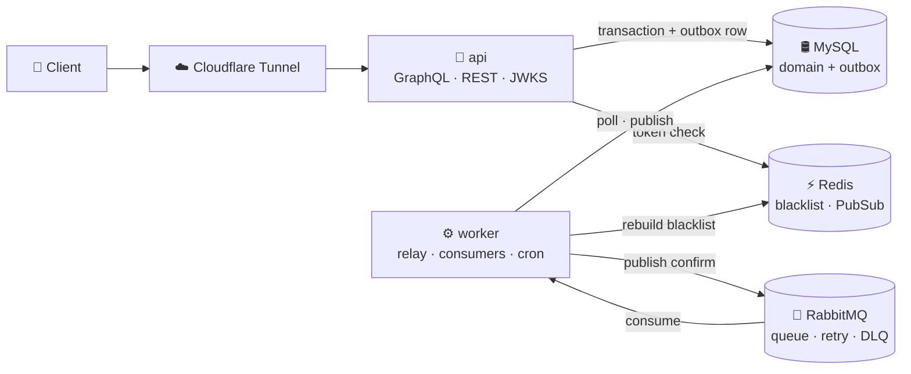
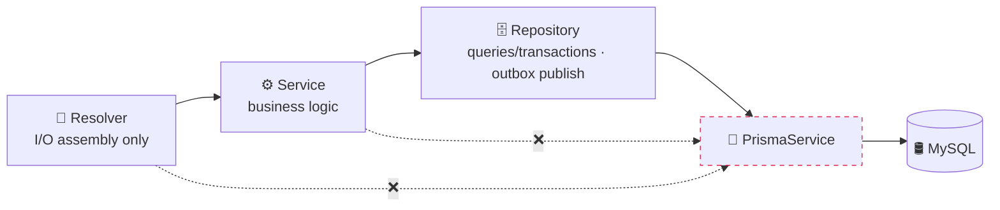
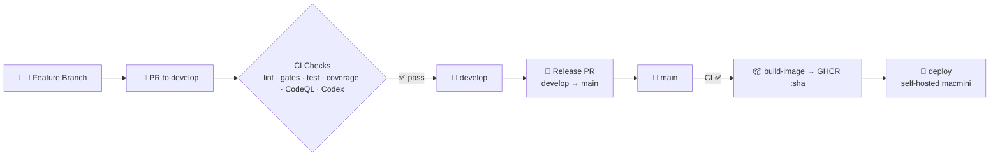

<div align="center">


# CaQuick Backend

**A visual, all-in-one custom cake ordering platform**

Browse cake designs → tweak a design → match a bakery → order, pay, and pick up.<br/>
Every step that used to be scattered across apps happens in one visual flow.

<br/>

[](./LICENSE)
[](https://nodejs.org/)
[](https://nestjs.com/)
[](https://www.typescriptlang.org/)

[](https://github.com/CaQuick/caquick-be/actions/workflows/pr-check.yml)
[](https://github.com/CaQuick/caquick-be/actions/workflows/codeql.yml)
[](https://app.codecov.io/gh/CaQuick/caquick-be)
[](https://github.com/CaQuick/caquick-be/commits/develop)

[한국어](./README.md) | **English**

</div>

## 📑 Table of Contents

- [Background](#-background)
- [Tech Stack](#-tech-stack)
- [Architecture](#%EF%B8%8F-architecture)
- [Directory Layout](#-directory-layout)
- [Getting Started](#-getting-started)
- [GraphQL](#-graphql)
- [Testing](#-testing)
- [Operations (Home Server)](#%EF%B8%8F-operations-home-server)
- [CI / CD](#%EF%B8%8F-ci--cd)
- [Team](#-team)
- [License](#-license)

## 🎯 Background

Ordering a custom cake is inherently a made-to-order purchase, yet the existing channels are not built for it.

| Channel            | Limitation                                                                                                                                |
| ------------------ | ----------------------------------------------------------------------------------------------------------------------------------------- |
| **Instagram**      | Plenty of design inspiration, but no integrated booking, ordering, or payment flow                                                        |
| **Naver**          | Store search and booking exist, but the design catalog and discovery experience are weak                                                  |
| **KakaoTalk / DM** | Images can be attached, but there is no structured design spec, so every order becomes an ad-hoc exchange of screenshots and explanations |

Customers end up hopping between platforms, combining screenshots, edits, and explanations by hand.

**CaQuick** brings that fragmented process into a single visual flow.

## 🧱 Tech Stack

### Language & Runtime


- **TypeScript** (strict mode) on **Node.js 24.x**, with **Yarn 4** managed through Corepack.

### Framework & API


- A single **NestJS 11** application runs as multiple processes that differ only by role (`APP_ROLE=api|ws|worker`): a modular monolith.
- **GraphQL** (schema-first SDL) + **Apollo Server 5** + `@nestjs/graphql`
  - Every field carries a description; coverage is kept at 100%.
  - Real-time notifications are delivered over Subscriptions backed by Redis PubSub.
- Generated docs and types
  - **GraphQL Code Generator**: SDL → TypeScript types
  - **SpectaQL**: GraphQL HTML docs (`/gql-docs`)
  - **Swagger**: REST docs (`/rest-docs`)

### Data & Messaging


- **MySQL 8** + **Prisma 7**: Prisma also owns migrations, and a Prisma extension injects the soft-delete filter automatically.
- **Redis 7** serves two purposes.
  - Auth blacklist: tokens of accounts that were suspended, deleted, or had their password changed are blocked immediately.
  - PubSub: delivers GraphQL Subscriptions.
- **RabbitMQ 4** is the event backbone.
  - Outbox rows written in the same domain transaction are published to the broker by a relay.
  - Consumers process messages through a retry queue and a DLQ (dead letter queue).

### Auth & Validation


- Sign-in methods
  - Buyers: **OIDC** (Google and Kakao via `openid-client`)
  - Sellers and admins: credentials hashed with **Argon2**
- Tokens
  - Access tokens are **RS256-signed JWTs**; the public key is published at `/.well-known/jwks.json`.
  - Refresh tokens travel in a cookie and rotate on every use.
- Input validation is handled by DTO classes decorated with `class-validator` and `class-transformer`.

### Testing


- **Jest** + **Testcontainers** + **Supertest**
  - Testcontainers starts real MySQL and Redis containers automatically; RabbitMQ consumer tests start a real broker container of their own.
  - HTTP paths are verified with Supertest.
- The database and Redis are never mocked: 325 suites and more than 3,000 cases run against real stores. See [Testing](#-testing) for details.

### Code Quality & Security


- Static checks: **ESLint** (strict rules plus the `boundaries` plugin enforcing feature boundaries) and **Prettier**, run by **Husky** and **lint-staged** before commit and push.
- Structural checks: **dependency-cruiser** gates layer direction and forbids cycles; **knip** reports unused code.
- Commit messages: **commitlint** enforces Conventional Commits.
- Coverage, security, dependencies: **Codecov** (patch 80%; global thresholds statements 96%, branches 86%), **CodeQL**, **Dependabot**
- Repo-specific gates
  - `dto:check`: SDL inputs ↔ DTO classes stay in sync
  - `docs:check`: SDL description coverage
  - Model ownership and cross-boundary read specs

### DevOps & Infrastructure

![AWS S3][aws-s3]


- Production runs on a **home server (Mac mini, OrbStack)**.
  - The compose file in [`infra/`](./infra/) brings up api, worker, MySQL, Redis, RabbitMQ, the backup container, and the observability stack together.
  - No inbound ports are opened; external traffic arrives only through a **Cloudflare Tunnel** (`api.caquick.site`).
- **AWS S3**: media storage (presigned URL uploads) and daily database backups (14-day retention)
- **Terraform**: S3 buckets, two least-privilege IAM users, and the GitHub repository and branch protection settings
- Observability stack
  - **Prometheus** scrapes the app's `/metrics`, RabbitMQ, the mysqld and redis exporters, and cAdvisor.
  - **Loki** collects docker logs; `requestId` and `eventId` join api and worker logs.
  - **Grafana** provides two dashboards and unified alerting; alerts go to Discord.
- **GitHub Actions**: PR checks → on merge to main, an arm64 image is built and pushed to GHCR → a self-hosted runner deploys it automatically. CodeQL, Dependabot, and Discord notifications also run on Actions.
- **Winston** writes structured JSON logs with `role`, `requestId`, and `eventId` fields.

## 🏗️ Architecture

### Modular Monolith + Event Backbone

One image is started as two processes that differ only by role.

- **api**: serves GraphQL, REST, docs, and JWKS.
- **worker**: runs the outbox relay, event consumers, cron jobs, and blacklist rebuilds.
- Delivery path for cross-domain side effects (creating notifications, updating daily order limits, and so on)
  1. An outbox row is written in the same transaction as the domain write.
  2. The worker's relay publishes the outbox row to RabbitMQ (publisher confirms).
  3. A worker consumer takes it from the queue and handles it. Failures go through the retry queue; once the limit is exceeded the message goes to the DLQ and an alert is raised.
- Delivery is at-least-once, so consumers are implemented idempotently.



### Layer Dependencies

Requests always flow in one direction.

- `dependency-cruiser` blocks Resolvers and Services from touching Prisma directly.
- Imports between features are allowed only through each feature's `index.ts` (its public API), enforced by the ESLint `boundaries` rule.



### Core Design Principles

- **Model ownership**: every model has exactly one owning feature.
  - Writes are allowed only from the owning feature (checked by `model-ownership.spec`).
  - Reads that cross a feature boundary are managed through an allowlist.
  - Display values from other domains, such as store names or product thumbnails, are not joined at read time; they are **copied into snapshot columns at creation time**.
- **Schema-first GraphQL**: SDL files are the single source of truth and `yarn graphql:codegen` keeps the types in sync. Every `input` needs a DTO class and every field needs a description; both are gated.
- **Error catalog**: domain errors are thrown as a single `DomainException('CODE')`, and the catalog is the source of truth for code, HTTP status, and message. Clients branch on `extensions.code` in the response.
- **Zero database reads on the auth path**: claims of a validly signed token are trusted.
  - Suspension, deletion, and password changes are blocked immediately by the Redis blacklist.
  - If Redis fails, the strategy falls back to a database lookup and raises an alert.
- **Fail-fast**: in production, boot is refused when the JWT key, S3 bucket, docs token, or metrics token is missing. `REDIS_URL` and `RABBITMQ_URL` are required in every environment.
- **A single exit for operational alerts**: only states that need a human (outbox FAILED, DLQ backlog, blacklist fallback, boot failure, backup failure, Grafana rules) are sent to Discord.

The reasoning and exceptions behind each rule live in [docs/guide/architecture-conventions.md](./docs/guide/architecture-conventions.md) (Korean).

## 📁 Directory Layout

```text
caquick-be/
├── src/
│   ├── main.ts                  # bootstrap (role wiring, boot-failure alert)
│   ├── app.module.ts            # AppModule.forRole(api|ws|worker)
│   ├── features/                # domain modules (1 folder = 1 domain; SDL, Resolver, Service, Repository colocated)
│   │   ├── auth/                #   OIDC · credentials · accounts · profiles · JWKS
│   │   ├── store/               #   stores · pickup schedules · seller/admin store management
│   │   ├── product/             #   products · categories · seller/admin product management
│   │   ├── order/               #   orders · payment · daily limits
│   │   ├── review/              #   reviews · likes · reports · moderation
│   │   ├── conversation/        #   buyer ↔ seller chat
│   │   ├── notification/        #   notification center · outbox consumer · admin broadcasts
│   │   ├── search/              #   search · trending keywords
│   │   ├── region/              #   regions
│   │   ├── mypage/              #   buyer "my page" composition
│   │   ├── dashboard/           #   admin dashboard
│   │   ├── audit-log/           #   audit log port
│   │   ├── outbox/              #   outbox publishing · relay · RabbitMQ consumer host · requeue
│   │   ├── system/              #   /health/live · /health/ready
│   │   └── core/                #   GraphQL root · shared scalars
│   ├── common/                  # dependency-free shared code (error catalog, cursors, utils)
│   ├── global/                  # cross-cutting (auth guards/blacklist, alerting, metrics, logger, redis, pubsub, storage)
│   ├── config/                  # env parsing and validation (fail-fast on required production keys)
│   ├── prisma/                  # PrismaService · soft-delete extension · activeWhere
│   ├── graphql/                 # codegen output (do not edit)
│   └── test/                    # factories · real-DB module builder · ownership/boundary gate specs
├── prisma/                      # schema.prisma · migrations · seed
├── infra/                       # home-server compose · deploy script · observability config · runbook
├── terraform/                   # GitHub repo/branch protection + AWS (S3, IAM) as code
├── scripts/                     # gate and ops scripts (dto:check · docs:check · outbox:requeue) + infra specs
├── docs/guide/                  # architecture conventions (source of truth)
└── .github/workflows/           # pr-check · build-image · deploy · codeql · knip · nestjs-doctor · discord-notify
```

## 🚀 Getting Started

### Prerequisites

| Item    | Version            | Notes                                                                           |
| ------- | ------------------ | ------------------------------------------------------------------------------- |
| Node.js | **24.x**           | `nvm install 24` is recommended                                                 |
| Yarn    | **4.x** (Corepack) | run `corepack enable` once                                                      |
| Docker  | latest             | needed for local MySQL/Redis/RabbitMQ (`docker-compose.yml`) and testcontainers |

### Install & Run

```bash
corepack enable && yarn install          # postinstall generates the Prisma client into src/generated/
docker compose up -d                     # MySQL 3306 · Redis 6379 · RabbitMQ 5672
touch .env                               # fill it in using the "Environment Variables" table below
yarn prisma:migrate:dev                  # apply migrations
yarn prisma:seed                         # (optional) seed data
yarn start:dev                           # api role, http://localhost:4000/graphql
APP_ROLE=worker PORT=4001 yarn start:dev # (optional) run a worker too if you want to see events consumed
```

Operational endpoints

- `GET /health/live`: process liveness only.
- `GET /health/ready`: checks MySQL and Redis (and RabbitMQ for the worker); returns 503 if any of them is down.
- `GET /metrics`: Prometheus metrics; requires a Bearer token (`METRICS_ACCESS_TOKEN`).

### Environment Variables

> There is no `.env.example` in the repository. The validation schemas live in [`src/config/`](./src/config/) and the production key list in [`infra/app.env.example`](./infra/app.env.example).

| Category                | Keys                                                                                                                                                                                                                                                                                               |
| ----------------------- | -------------------------------------------------------------------------------------------------------------------------------------------------------------------------------------------------------------------------------------------------------------------------------------------------- |
| **Server**              | `NODE_ENV`, `PORT`, `BACKEND_BASE_URL`, `FRONTEND_BASE_URL` (comma-separated list; used for CORS and returnTo checks), `APP_ROLE` (`api`, `ws`, `worker`; default `api`), `TRUST_PROXY_HOPS`                                                                                                       |
| **Database**            | `DATABASE_URL`                                                                                                                                                                                                                                                                                     |
| **Redis (required)**    | `REDIS_URL`. Used for the auth blacklist and Subscription PubSub. If `maxmemory` is set, the policy must be `noeviction`; otherwise the worker detects it, raises an alert, and auth falls back to the database                                                                                    |
| **RabbitMQ (required)** | `RABBITMQ_URL`. The event backbone from the outbox relay to consumers                                                                                                                                                                                                                              |
| **JWT / Auth**          | `JWT_PRIVATE_KEY_PEM_B64` (or `JWT_PRIVATE_KEY_PATH`) is the RS256 signing key and is required in production. `JWT_PUBLIC_KEY_PEM_B64` is derived from the private key when omitted. Also `JWT_ISSUER`, `JWT_AUDIENCE`, `JWT_ACCESS_EXPIRES_SECONDS`, `AUTH_REFRESH_EXPIRES_DAYS`, `AUTH_COOKIE_*` |
| **OIDC**                | `OIDC_GOOGLE_CLIENT_ID/SECRET/ISSUER_URL`, `OIDC_KAKAO_CLIENT_ID/SECRET/ISSUER_URL`, `OIDC_TEMP_COOKIE_MAX_AGE_MS`                                                                                                                                                                                 |
| **AWS S3**              | `AWS_ACCESS_KEY_ID`, `AWS_SECRET_ACCESS_KEY` (IAM user `caquick-app`, media put/get only), `AWS_REGION`, `AWS_S3_BUCKET` (required in production), `S3_PRESIGN_EXPIRES_SECONDS`                                                                                                                    |
| **Docs · Metrics**      | `DOCS_ACCESS_TOKEN` (access token for `/gql-docs` and `/rest-docs`, required in production), `METRICS_ACCESS_TOKEN` (Bearer token for `/metrics`, required in production)                                                                                                                          |
| **Alerts (optional)**   | `DISCORD_ALERT_WEBHOOK_URL` (log-only when unset), `ALERT_DEDUPE_WINDOW_MS` (default 5 minutes), `BOOT_ALERT_STATE_DIR` (suppression files for boot-failure alerts, default `~/.caquick/boot-alert`)                                                                                               |
| **Outbox (optional)**   | `OUTBOX_DISPATCH_ENABLED` (only `false` has an effect; enabling is decided by the worker role), `OUTBOX_POLL_INTERVAL_MS`, `OUTBOX_BATCH_SIZE`, `OUTBOX_MAX_ATTEMPTS`, `OUTBOX_PARTITION_CONCURRENCY`                                                                                              |
| **Seed (optional)**     | `ADMIN_SEED_USERNAME`, `ADMIN_SEED_PASSWORD`, `SELLER_SEED_PASSWORD`                                                                                                                                                                                                                               |

### Common Scripts

| Command                   | Purpose                                                                                                      |
| ------------------------- | ------------------------------------------------------------------------------------------------------------ |
| `yarn validate`           | runs lint, tsc, dto:check, docs:check, arch:check, test:scripts, and test:cov in sequence (same as pre-push) |
| `yarn test [path]`        | Jest integration tests against a real database (Docker required)                                             |
| `yarn test:scripts`       | infrastructure and workflow specs (`scripts/*.spec.ts`)                                                      |
| `yarn graphql:codegen`    | generates TypeScript types from the SDL                                                                      |
| `yarn dto:check`          | verifies SDL inputs and DTO classes are in sync                                                              |
| `yarn docs:check`         | verifies SDL description coverage                                                                            |
| `yarn arch:check`         | checks layer direction and cycles with dependency-cruiser                                                    |
| `yarn prisma:migrate:dev` | creates and applies a migration, then regenerates the client                                                 |
| `yarn graphql:docs`       | builds the SpectaQL HTML docs into `public/`                                                                 |
| `yarn outbox:requeue`     | reprocesses FAILED outbox events in production (`--id`, `--event-type`, `--all`, `--republish`)              |

## 🧬 GraphQL

The API is **schema-first**. The `.graphql` SDL files are the single source of truth, and every change is followed by `yarn graphql:codegen` to sync the TypeScript types.

```graphql
# src/features/auth/auth-user-profile.graphql
extend type Query {
  """
  현재 로그인한 유저 정보 조회
  """
  me: MePayload!
}
```

- Each domain extends the schema with `extend type Query` and `extend type Mutation`; the root definitions live in `src/features/core/root.graphql`.
- Every `input` must have a matching DTO class (checked by `dto:check`) and every field must have a description (checked by `docs:check`; currently 100%).
- List queries use keyset cursors and return `{ items, totalCount, hasMore, nextCursor }`. Errors are reported through `extensions.code` (catalog code) and `extensions.classification` (HTTP class).
- The generated type file (`src/graphql/graphql.types.ts`) is never edited by hand. Playground and introspection are disabled in production.

## 🧪 Testing

> **The database and Redis are never mocked.** [Testcontainers](https://node.testcontainers.org/) starts real MySQL 8 and Redis 7 containers and applies the Prisma migrations before the tests run. The RabbitMQ consumer host is verified against a real broker container.

| Layer                                  | Purpose                                                                                                                        |
| -------------------------------------- | ------------------------------------------------------------------------------------------------------------------------------ |
| `*.service.spec.ts`                    | branches, errors, and domain logic against the real database (the bulk of the suite)                                           |
| `*.resolver.spec.ts`                   | one or two end-to-end cases from the Resolver down to the database                                                             |
| `*.repository.spec.ts`                 | contracts reachable only through the Repository                                                                                |
| `*.input.spec.ts` · `*.helper.spec.ts` | pure unit tests that need no database                                                                                          |
| `src/test/*.spec.ts`                   | gates for model ownership, cross-boundary reads, audit write paths, per-role authorization coverage, module wiring             |
| `scripts/*.spec.ts`                    | infrastructure specs: compose rendering, backup and restore (real mysql), deploy workflows, observability config, build config |

```bash
yarn test                     # everything (Docker required)
yarn test src/features/order  # a single domain
yarn test:cov                 # coverage (thresholds: statements 96 / branches 86 / functions 92 / lines 96)
yarn test:scripts             # infrastructure specs
```

When a checker or gate is added, the **refutation cases** (proving it actually blocks what it should) are the core of its tests. CI uses the same testcontainers setup, so there is little difference between local and CI environments.

## 🖥️ Operations (Home Server)

A single Mac mini (OrbStack) runs 13 containers from the production compose file. Files and procedures are in [`infra/`](./infra/); backup, restore, rollback, and outbox reprocessing are documented in [`infra/runbook.md`](./infra/runbook.md) (Korean).

```bash
docker build -t caquick-be:local .                        # multi-stage build (deps → build → runtime, non-root)
cd infra && cp .env.example .env && cp app.env.example app.env   # fill in the values (in production the deploy job writes them from secrets)
docker compose --profile migrate run --rm migrate         # prisma migrate deploy
docker compose up -d                                      # api · worker · mysql · redis · rabbitmq · backup
docker compose --profile observability up -d              # alloy · loki · prometheus · grafana · exporters
docker compose --profile edge up -d                       # cloudflared (TUNNEL_TOKEN required)
```

- Configuration is split into two files so that the api container, which has a public interface, never holds the root password or the tunnel token.
  - `.env`: compose interpolation values plus store and tunnel secrets
  - `app.env`: only what the app (api, worker, migrate) reads
- No inbound ports are opened. Diagnostic ports (Grafana 3001, Prometheus 9090, RabbitMQ management 15672) are bound to `127.0.0.1` only.
- Backups and alerts
  - A mysqldump is uploaded to S3 every day (14-day retention).
  - Eight Grafana alert rules and the application alerts are sent to Discord.
- Container memory limits add up to 6 GB or less; the measured table is in the runbook.
- Operational invariants (no exposed ports, Redis `noeviction`, health checks, the memory-limit total, secret separation) are verified by `scripts/compose-config.spec.ts` to prevent regressions.

## ⚙️ CI / CD

### Workflows

| Workflow                         | Trigger                                              | Role                                                                                                                                                                             |
| -------------------------------- | ---------------------------------------------------- | -------------------------------------------------------------------------------------------------------------------------------------------------------------------------------- |
| `pr-check.yml`                   | PR · push (main/develop)                             | codegen, tsc, lint, dto/docs/arch gates, infrastructure specs, integration tests, coverage, and two consecutive builds (cache regression check)                                  |
| `codeql.yml`                     | PR · push · weekly                                   | CodeQL static security analysis                                                                                                                                                  |
| `knip.yml` · `nestjs-doctor.yml` | PR                                                   | comments with unused-code and NestJS health reports (advisory)                                                                                                                   |
| `build-image.yml`                | PR (build only) · main **after CI succeeds** (push)  | builds an arm64 image and pushes `ghcr.io/caquick/caquick-be:<sha>` (no mutable tags)                                                                                            |
| `deploy.yml`                     | `build-image` success (main) · manual (rollback sha) | the self-hosted runner (Mac mini) writes `.env` and `app.env` (mode 600) from secrets, then pull → migrate → worker → api → readiness wait → observability, and notifies Discord |
| `discord-notify.yml`             | PR · push · issue                                    | Discord notifications                                                                                                                                                            |

### Flow



### Branch Protection

- **main**: PR and passing CI are required; direct pushes are forbidden.
- **develop**: PR and passing CI are recommended. Admin direct pushes are allowed only for the fast-forward sync after a release.
- Required status checks: `check`, `pr-title`, `coverage-report`, `Analyze (javascript-typescript)`
- Bot reviews act as the effective gate instead of human approval.
  - Codex: every PR
  - CodeRabbit: PRs targeting main
- The **production Environment** is restricted to the `main` branch, and the self-hosted runner label (`macmini`) is used only by `deploy.yml`, so PR code from this public repository never runs on the home server.
- Branch protection, repository settings, and AWS resources are managed as code in [`terraform/`](./terraform/).

## 👤 Team

<table>
  <tr>
    <td align="center">
      <a href="https://github.com/chanwoo7">
        <br/>
        <sub><b>chanwoo7</b></sub>
      </a>
      <br/>
      <sub>Backend Developer</sub>
    </td>
  </tr>
</table>

## 📜 License

This project is distributed under the **Apache License 2.0**.

- Commercial use, modification, and redistribution are permitted.
- Redistributions must keep the copyright notice and a copy of the license, and modified files must carry a notice of the change.
- Contributors grant a patent license along with the code.

See the [LICENSE](./LICENSE) file for the full terms.

Copyright © 2026 CaQuick. All rights reserved.

<!-- ─────────────────────────────────────────────────────────
     AWS service badge definition (base64-embedded SVG icon, optimized with SVGO)
     SVG source: gilbarbara/logos (MIT) — .github/assets/aws/
     SVGO multipass keeps the GitHub camo proxy URL under the ~4KB limit
     ───────────────────────────────────────────────────────── -->

[aws-s3]: https://img.shields.io/badge/AWS%20S3-569A31?style=flat&logo=data:image/svg+xml;base64,PHN2ZyB4bWxucz0iaHR0cDovL3d3dy53My5vcmcvMjAwMC9zdmciIHdpZHRoPSIyNTYiIGhlaWdodD0iMjU2IiBwcmVzZXJ2ZUFzcGVjdFJhdGlvPSJ4TWlkWU1pZCIgdmlld0JveD0iMCAwIDI1NiAyNTYiPjx0aXRsZT5BV1MgU2ltcGxlIFN0b3JhZ2UgU2VydmljZSAoUzMpPC90aXRsZT48ZGVmcz48bGluZWFyR3JhZGllbnQgaWQ9ImEiIHgxPSIwJSIgeDI9IjEwMCUiIHkxPSIxMDAlIiB5Mj0iMCUiPjxzdG9wIG9mZnNldD0iMCUiIHN0b3AtY29sb3I9IiMxYjY2MGYiLz48c3RvcCBvZmZzZXQ9IjEwMCUiIHN0b3AtY29sb3I9IiM2Y2FlM2UiLz48L2xpbmVhckdyYWRpZW50PjwvZGVmcz48cGF0aCBmaWxsPSJ1cmwoI2EpIiBkPSJNMCAwaDI1NnYyNTZIMHoiLz48cGF0aCBmaWxsPSIjZmZmIiBkPSJtMTk0LjY3NSAxMzcuMjU2IDEuMjI5LTguNjUyYzExLjMzIDYuNzg3IDExLjQ3OCA5LjU5IDExLjQ3NSA5LjY2Ny0uMDIuMDE2LTEuOTUyIDEuNjI5LTEyLjcwNC0xLjAxNW0tNi4yMTgtMS43MjhjLTE5LjU4NC01LjkyNi00Ni44NTctMTguNDM4LTU3Ljg5NC0yMy42NTQgMC0uMDQ1LjAxMy0uMDg2LjAxMy0uMTMxIDAtNC4yNC0zLjQ1LTcuNjktNy42OTMtNy42OS00LjIzNyAwLTcuNjg3IDMuNDUtNy42ODcgNy42OXMzLjQ1IDcuNjkgNy42ODcgNy42OWMxLjg2MiAwIDMuNTUyLS42OTUgNC44ODYtMS44IDEyLjk4NiA2LjE0OCA0MC4wNDggMTguNDc4IDU5Ljc3NiAyNC4zMDJsLTcuODAxIDU1LjA1OXEtLjAzMy4yMjUtLjAzMi40NTFjMCA0Ljg0OC0yMS40NjMgMTMuNzU0LTU2LjUzMiAxMy43NTQtMzUuNDQgMC01Ny4xMy04LjkwNi01Ny4xMy0xMy43NTRxMC0uMjItLjAyOC0uNDM1bC0xNi4zLTExOS4wNjJjMTQuMTA4IDkuNzEyIDQ0LjQ1NCAxNC44NSA3My40NzggMTQuODUgMjguOTc5IDAgNTkuMjczLTUuMTIgNzMuNDEtMTQuODAyek00OCA2NS41MjhjLjIzLTQuMjEgMjQuNDI4LTIwLjczIDc1LjItMjAuNzMgNTAuNzY0IDAgNzQuOTY2IDE2LjUxNiA3NS4yIDIwLjczdjEuNDM3Yy0yLjc4NCA5LjQ0My0zNC4xNDQgMTkuNDM0LTc1LjIgMTkuNDM0LTQxLjEyNyAwLTcyLjUwMy0xMC4wMjMtNzUuMi0xOS40Nzl6bTE1Ni44LjA3YzAtMTEuMDg3LTMxLjc5LTI3LjItODEuNi0yNy4yLTQ5LjgxMiAwLTgxLjYgMTYuMTEzLTgxLjYgMjcuMmwuMyAyLjQxNCAxNy43NTQgMTI5LjY3NmMuNDI2IDE0LjUwMyAzOS4xIDE5LjkxIDYzLjUyNiAxOS45MSAzMC4zMSAwIDYyLjUxMi02Ljk2OSA2Mi45MjgtMTkuOWw3LjY2OC01NC4wN2M0LjI2NSAxLjAyIDcuNzc2IDEuNTQyIDEwLjU5NSAxLjU0MiAzLjc4NSAwIDYuMzQ1LS45MjUgNy44OTctMi43NzQgMS4yNzQtMS41MTcgMS43Ni0zLjM1NCAxLjM5Ni01LjMxLS44My00LjQyOC02LjA4Ny05LjIwMi0xNi43OTQtMTUuMzExbDcuNjAzLTUzLjYzOXoiLz48L3N2Zz4=
