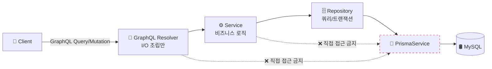
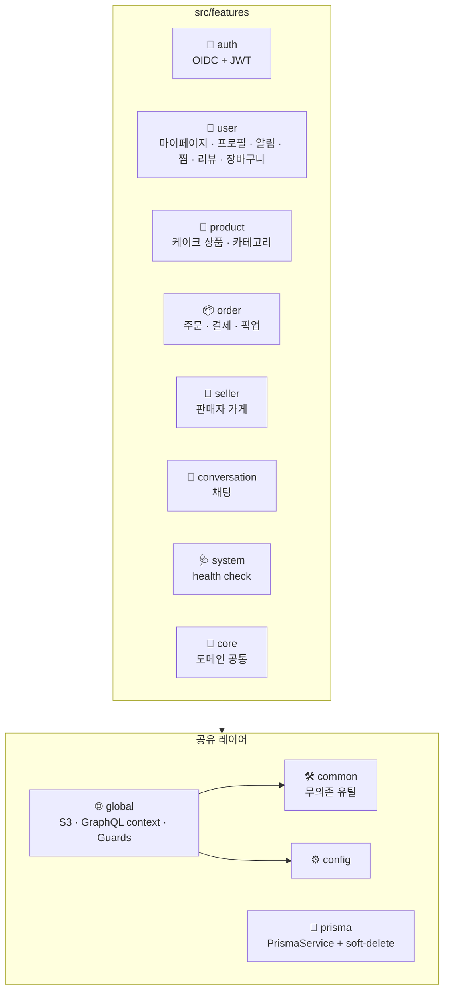
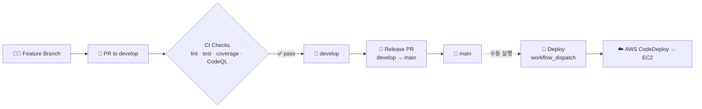

<div align="center">


# 케이퀵 - CaQuick Backend

**시각 기반 올인원 맞춤 케이크 주문 플랫폼**

케이크 디자인 탐색 → 디자인 수정 → 가게 매칭 → 주문·결제·픽업까지<br/>
단절된 모든 과정을 하나의 시각 기반 흐름으로 통합합니다.

<br/>

[](./LICENSE)
[](https://nodejs.org/)
[](https://nestjs.com/)
[](https://www.typescriptlang.org/)

[](https://github.com/CaQuick/caquick-be/actions/workflows/pr-check.yml)
[](https://github.com/CaQuick/caquick-be/actions/workflows/codeql.yml)
[](https://app.codecov.io/gh/CaQuick/caquick-be)
[](https://github.com/CaQuick/caquick-be/commits/develop)

</div>

## 📑 목차

- [기획 배경](#-기획-배경)
- [기술 스택](#-기술-스택)
- [아키텍처](#%EF%B8%8F-아키텍처)
- [디렉터리 구조](#-디렉터리-구조)
- [시작하기](#-시작하기)
- [GraphQL](#-graphql)
- [테스트](#-테스트)
- [CI / CD](#%EF%B8%8F-ci--cd)
- [팀](#-팀)
- [라이선스](#-라이선스)

## 🎯 기획 배경

케이크 디자인 주문은 본질적으로 **맞춤형 상품**이지만, 기존 플랫폼들은 이에 최적화되어 있지 않습니다.

| 채널 | 한계 |
| --- | --- |
| **인스타그램** | 디자인 영감은 풍부하지만 통합된 예약·주문·결제 흐름이 없음 |
| **네이버** | 가게 검색·예약 기능은 있지만 디자인 카탈로그·탐색 UX가 약함 |
| **카톡·DM** | 이미지 첨부는 가능하지만 정형 디자인 명세 양식이 없어 매번 캡처·설명·확인을 비정형으로 주고받아야 함 |

사용자는 결국 **여러 플랫폼을 옮겨 다니며 캡처 + 편집 + 설명을 조합**하는 비효율을 감내해야 합니다.

**케이퀵**은 이 단절된 과정을 시각 기반 단일 흐름으로 통합하는 서비스입니다.

## 🧱 기술 스택

### Language & Runtime


- **TypeScript** (strict) · **Node.js 24.x** · **Yarn 4** (Corepack)

### Framework & API


- **NestJS 11** — Modules · DI · Guards · Interceptors
- **GraphQL** (schema-first SDL) · **Apollo Server 5** · `@nestjs/graphql`
- Doc / codegen 툴체인: **GraphQL Code Generator** (TS 타입 자동생성) · **SpectaQL** (GraphQL HTML 문서) · **Swagger** (REST `/rest-docs`, `@nestjs/swagger`)

### Database & ORM


- **MySQL 8** · **Prisma 6** (ORM + Migrations) · Custom soft-delete extension

### Auth & Validation


- **OIDC** (Google · Kakao) via `openid-client`
- **JWT** (`@nestjs/jwt` + Passport) · **Argon2** (자격 증명 해시)
- `class-validator` · `class-transformer` 기반 DTO 검증

### Testing


- **Jest** + **Testcontainers** (Docker 컨테이너로 실 MySQL 자동 spin-up) + **Supertest**
- DB mock 미사용 — 실 DB 통합 테스트 ([→ 테스트 섹션](#-테스트))

### Code Quality & Security


- **ESLint** (strict) · **Prettier** · **Husky** + **lint-staged**
- **commitlint** (Conventional Commits 강제) · **Codecov** (patch threshold 80%)
- **CodeQL** (GitHub Actions 기반 SAST) · **Dependabot** (의존성 자동 PR · 메이저는 ignore 정책)

### DevOps & Infrastructure

![AWS EC2][aws-ec2]
![AWS RDS][aws-rds]
![AWS S3][aws-s3]
![AWS CodeDeploy][aws-codedeploy]


- **AWS**: EC2 (서버) · RDS MySQL (DB) · S3 + Presigned URL (미디어) · CodeDeploy (배포 자동화)
- **Docker** (compose) — 로컬 개발 + testcontainers
- **Terraform**으로 GitHub repository / branch protection 관리 (IaC)
- **GitHub Actions** — pr-check · deploy · CodeQL · Dependabot
- **PM2** — EC2 프로세스 매니저
- **Discord webhook** — PR · push · issue 이벤트 알림
- **Winston** 구조화 로그 + `x-request-id` 상관관계 추적

## 🏗️ 아키텍처

### 레이어 의존성

요청은 항상 **단방향**으로 흐릅니다. Resolver/Service가 `PrismaService`나 `PrismaClient`에 직접 접근하는 것은 금지되어 있으며, 모든 DB 접근은 Repository를 경유합니다.



### Feature 모듈 구성

도메인별로 폴더가 분리되며 (`src/features/*`), 각 feature는 SDL · Resolver · Service · Repository · DTO · Constants를 colocate합니다. Feature 간에는 서로의 내부 파일을 직접 import하지 않고 **Module export provider**로만 주입받습니다.



### 핵심 설계 원칙

- **의존성 방향 강제**: `Resolver → Service → Repository → Prisma`. 역방향/우회 금지
- **Schema-First GraphQL**: SDL이 단일 소스 (`*.graphql` 파일). 변경 시 `yarn graphql:codegen`으로 타입 동기화
- **Domain Model 격리**: Prisma model 타입을 Resolver/Service에 직접 노출하지 않고 domain 모델/DTO로 매핑
- **Soft-delete 일관성**: `prisma/soft-delete.middleware.ts` Extension이 모든 READ 쿼리에 `deleted_at: null` 자동 주입 (의도적 우회 가능)
- **Fail-fast**: 운영 환경에서 JWT 시크릿 누락 시 서버 부팅 차단. GraphQL Playground 운영에서 비활성

## 📁 디렉터리 구조

```text
caquick-be/
├── src/
│   ├── main.ts                  # 부트스트랩 (NestFactory)
│   ├── app.module.ts            # 루트 모듈
│   ├── features/                # 도메인 모듈 (1 폴더 = 1 도메인)
│   │   ├── auth/                #   OIDC + JWT
│   │   ├── user/                #   마이페이지 · 프로필 · 알림 · 찜 · 리뷰 ...
│   │   ├── product/             #   케이크 상품
│   │   ├── order/               #   주문 · 결제 · 픽업
│   │   ├── seller/              #   판매자 가게
│   │   ├── conversation/        #   채팅
│   │   ├── system/              #   health check
│   │   └── core/                #   도메인 공통
│   ├── common/                  # 무의존 공용 유틸 (외부 의존 X)
│   ├── global/                  # 글로벌 (S3, Guards, GraphQL context)
│   ├── config/                  # 환경별 설정 · 검증
│   ├── prisma/                  # PrismaService · soft-delete extension
│   ├── graphql/                 # codegen 출력 (autogen, 수정 금지)
│   └── test/                    # 테스트 인프라 (factories · helpers)
├── prisma/
│   ├── schema.prisma            # DB 스키마 단일 소스
│   ├── migrations/              # 마이그레이션 히스토리
│   └── seed.ts                  # 시드 스크립트
├── terraform/                   # GitHub repo 설정 IaC
├── .github/
│   ├── workflows/               # GitHub Actions
│   ├── dependabot.yml           # 의존성 자동 업데이트
│   └── assets/                  # README 등 GitHub 노출용 자산
├── scripts/                     # CodeDeploy lifecycle hooks
└── public/                      # SpectaQL HTML 문서 출력
```

## 🚀 시작하기

### Prerequisites

| 항목 | 버전 | 비고 |
| --- | --- | --- |
| Node.js | **24.x** | `nvm install 24` 권장 |
| Yarn | **4.x** (Corepack) | `corepack enable` 한 번 실행 |
| MySQL | **8.x** | 로컬 또는 Docker (`docker-compose.yml` 제공) |
| Docker | latest | 통합 테스트에서 testcontainers가 MySQL 컨테이너를 띄움 |

### 설치 & 실행

```bash
# 1. 의존성 설치
corepack enable
yarn install

# 2. 환경 변수 (.env 직접 생성 — 아래 "필요 환경 변수" 표 참고)
touch .env

# 3. DB 마이그레이션
yarn prisma:migrate:dev

# 4. (선택) 시드 데이터 주입
yarn prisma:seed

# 5. 개발 서버 (watch mode)
yarn start:dev
```

기본 GraphQL endpoint: `http://localhost:4000/graphql` (`PORT` 환경변수로 변경 가능)

### 필요 환경 변수

> `.env.example`은 보안상 레포에 포함되지 않습니다. 아래 키를 참고해 `.env`를 직접 작성해 주세요. 정확한 검증 스키마는 [`src/config/`](./src/config/) 참고.

| 카테고리 | 키 |
| --- | --- |
| **서버** | `NODE_ENV`, `PORT`, `BACKEND_BASE_URL`, `FRONTEND_BASE_URL` |
| **DB** | `DATABASE_URL` |
| **JWT / Auth** | `JWT_ACCESS_SECRET`, `JWT_ACCESS_EXPIRES_SECONDS`, `AUTH_REFRESH_EXPIRES_DAYS`, `AUTH_COOKIE_DOMAIN`, `AUTH_COOKIE_SECURE` |
| **OIDC (Google)** | `OIDC_GOOGLE_CLIENT_ID`, `OIDC_GOOGLE_CLIENT_SECRET`, `OIDC_GOOGLE_ISSUER_URL` |
| **OIDC (Kakao)** | `OIDC_KAKAO_CLIENT_ID`, `OIDC_KAKAO_CLIENT_SECRET`, `OIDC_KAKAO_ISSUER_URL` |
| **OIDC (공통)** | `OIDC_TEMP_COOKIE_MAX_AGE_MS` |
| **AWS S3** | `AWS_ACCESS_KEY_ID`, `AWS_SECRET_ACCESS_KEY`, `AWS_REGION`, `AWS_S3_BUCKET`, `S3_PRESIGN_EXPIRES_SECONDS` |
| **Docs (선택)** | `DOCS_ACCESS_TOKEN` |

### 자주 쓰는 스크립트

| 명령 | 용도 |
| --- | --- |
| `yarn start:dev` | NestJS watch 모드 |
| `yarn build` | 프로덕션 빌드 (`dist/`) |
| `yarn lint` | ESLint --fix |
| `yarn test` | Jest (실 DB 통합 테스트 포함) |
| `yarn test:cov` | 커버리지 측정 (임계 미달 시 비-0 종료) |
| `yarn dto:check` | SDL ↔ DTO 동기화 검사 (마이그레이션 중 warning 모드) |
| `yarn validate` | lint + tsc + dto:check + test:cov 일괄. push 전 권장 |
| `yarn prisma:migrate:dev` | DB 마이그레이션 생성/적용 |
| `yarn prisma:studio` | Prisma Studio (GUI DB 브라우저) |
| `yarn graphql:codegen` | SDL → TypeScript 타입 생성 |
| `yarn graphql:docs` | SpectaQL HTML 문서 빌드 (`public/`) |

## 🧬 GraphQL

**Schema-First** 방식을 채택합니다. `.graphql` SDL 파일이 단일 소스이며, 변경 시 codegen으로 TypeScript 타입을 동기화합니다.

```graphql
# src/features/user/user-profile.graphql
extend type Query {
  """현재 로그인한 유저 정보 조회"""
  me: MePayload!
}

type MePayload {
  accountId: ID!
  email: String
  accountType: AccountType!
  profile: UserProfile!
  """연동된 소셜 로그인 식별자 목록(soft-deleted 제외, 최근 로그인 순)"""
  linkedIdentities: [LinkedIdentity!]!
}
```

```bash
# SDL 수정 후 항상 codegen 실행
yarn graphql:codegen
```

- 각 도메인은 `extend type Query` / `extend type Mutation` 패턴으로 schema를 확장
- 생성된 타입(`src/graphql/graphql.types.ts`)은 자동 생성물 — 직접 수정 금지
- 운영 환경에서 Apollo Playground는 비활성 (`introspection` off)

## 🧪 테스트

> **DB는 mock하지 않습니다.** 모든 통합 테스트는 [Testcontainers](https://node.testcontainers.org/)로 실제 MySQL 컨테이너를 자동 spin-up한 뒤 Prisma 마이그레이션까지 적용해 검증합니다.

### 왜 실DB로?

- Prisma 쿼리/관계/제약조건 동작이 mock과 미묘하게 다를 수 있어, mock이 통과해도 운영 마이그레이션이 깨지는 케이스를 사전에 잡습니다
- soft-delete extension이 `where`에 자동 주입되는 동작 등 **ORM 레이어 통합 동작**을 검증
- 트랜잭션 격리, 유니크 제약, 외래 키 cascade 동작까지 실제 DB 의미론으로 확인

### 테스트 레이어

| 레이어 | 목적 |
| --- | --- |
| `*.service.spec.ts` | 단위 + 실 DB. 분기/예외/도메인 로직 |
| `*.resolver.spec.ts` | Resolver ↔ Service ↔ Repository ↔ DB 전체 경로 통합 (1~2 happy/error 케이스) |
| `*.repository.spec.ts` | Repository 단위에서만 도달 가능한 API contract |

```bash
# 전체 실행 (testcontainers가 MySQL 컨테이너를 띄움 — Docker 필요)
yarn test

# 특정 도메인만
yarn test src/features/user

# 커버리지 (patch threshold 80%)
yarn test:cov
```

CI에서도 동일하게 testcontainers로 격리된 MySQL을 띄우므로 로컬과 환경 차이가 거의 없습니다.

## ⚙️ CI / CD

### 워크플로우

| Workflow | Trigger | 역할 |
| --- | --- | --- |
| `pr-check.yml` | PR (develop/main) | lint · typecheck · 통합 테스트 · 커버리지 |
| `codeql.yml` | PR · push · 주간 | GitHub CodeQL SAST |
| `discord-notify.yml` | PR · push · issue | Discord 알림 |
| `deploy.yml` | **수동** (`workflow_dispatch`) | EC2 + RDS 인프라 비활성 기간 동안 자동 배포 중단 |

### 흐름



### 브랜치 보호

- **main**: PR + CI 통과 필수. 직접 push 금지
- **develop**: PR + CI 통과 권장. Repository Admin은 release sync 목적으로 fast-forward 직접 push 가능
- 필수 status check: `check`, `pr-title`, `coverage-report`, `Analyze (javascript-typescript)`
- 브랜치 보호 / 레포 설정은 [`terraform/`](./terraform/)에서 IaC로 관리

## 👤 팀

<table>
  <tr>
    <td align="center">
      <a href="https://github.com/chanwoo7">
        <br/>
        <sub><b>chanwoo7</b></sub>
      </a>
      <br/>
      <sub>Backend Developer</sub>
    </td>
  </tr>
</table>

## 📜 라이선스

이 프로젝트는 **Business Source License 1.1 (BUSL-1.1)** 으로 배포됩니다.

- 비상업적 / 학습 / 평가 목적의 사용은 자유롭게 허용됩니다
- **케이크 주문 플랫폼과 경쟁하는 상업 서비스**로의 이용은 별도 라이선스 협의가 필요합니다
- Change Date(`2030-05-20`) 이후 **Apache License 2.0**으로 자동 전환됩니다

전체 조항은 [LICENSE](./LICENSE) 파일을 참고하세요.

Copyright © 2026 CaQuick. All rights reserved.


<!-- ─────────────────────────────────────────────────────────
     AWS service badge 정의 (base64-embedded SVG icons, SVGO 최적화 적용)
     SVG 출처: gilbarbara/logos (MIT) — .github/assets/aws/
     GitHub camo proxy URL 길이 ~4KB 한도 준수를 위해 SVGO multipass 처리
     ───────────────────────────────────────────────────────── -->
[aws-ec2]: https://img.shields.io/badge/AWS%20EC2-FF9900?style=flat&logo=data:image/svg+xml;base64,PHN2ZyB4bWxucz0iaHR0cDovL3d3dy53My5vcmcvMjAwMC9zdmciIHdpZHRoPSIyNTYiIGhlaWdodD0iMjU2IiBwcmVzZXJ2ZUFzcGVjdFJhdGlvPSJ4TWlkWU1pZCIgdmlld0JveD0iMCAwIDI1NiAyNTYiPjx0aXRsZT5BV1MgRWxhc3RpYyBDb21wdXRlIENsb3VkIChFQzIpPC90aXRsZT48ZGVmcz48bGluZWFyR3JhZGllbnQgaWQ9ImEiIHgxPSIwJSIgeDI9IjEwMCUiIHkxPSIxMDAlIiB5Mj0iMCUiPjxzdG9wIG9mZnNldD0iMCUiIHN0b3AtY29sb3I9IiNjODUxMWIiLz48c3RvcCBvZmZzZXQ9IjEwMCUiIHN0b3AtY29sb3I9IiNmOTAiLz48L2xpbmVhckdyYWRpZW50PjwvZGVmcz48cGF0aCBmaWxsPSJ1cmwoI2EpIiBkPSJNMCAwaDI1NnYyNTZIMHoiLz48cGF0aCBmaWxsPSIjZmZmIiBkPSJNODYuNCAxNjkuNmg4MHYtODBoLTgwem04Ni40LTgwaDEyLjhWOTZoLTEyLjh2MTIuOGgxMi44djYuNGgtMTIuOHY5LjZoMTIuOHY2LjRoLTEyLjhWMTQ0aDEyLjh2Ni40aC0xMi44djEyLjhoMTIuOHY2LjRoLTEyLjh2LjQzNWE1Ljk3IDUuOTcgMCAwIDEtNS45NjUgNS45NjVoLS40MzV2MTIuOEgxNjBWMTc2aC0xMi44djEyLjhoLTYuNFYxNzZoLTkuNnYxMi44aC02LjRWMTc2SDExMnYxMi44aC02LjRWMTc2SDkyLjh2MTIuOGgtNi40VjE3NmgtLjQzNUE1Ljk3IDUuOTcgMCAwIDEgODAgMTcwLjAzNXYtLjQzNWgtOS42di02LjRIODB2LTEyLjhoLTkuNlYxNDRIODB2LTEyLjhoLTkuNnYtNi40SDgwdi05LjZoLTkuNnYtNi40SDgwVjk2aC05LjZ2LTYuNEg4MHYtLjQzNWE1Ljk3IDUuOTcgMCAwIDEgNS45NjUtNS45NjVoLjQzNVY3MC40aDYuNHYxMi44aDEyLjhWNzAuNGg2LjR2MTIuOGgxMi44VjcwLjRoNi40djEyLjhoOS42VjcwLjRoNi40djEyLjhIMTYwVjcwLjRoNi40djEyLjhoLjQzNWE1Ljk3IDUuOTcgMCAwIDEgNS45NjUgNS45NjV6bS00MS42IDEyMS4yMDNhLjQuNCAwIDAgMS0uMzk3LjM5N0g0NS4xOTdhLjQuNCAwIDAgMS0uMzk3LS4zOTd2LTg1LjYwNmEuNC40IDAgMCAxIC4zOTctLjM5N0g2NHYtNi40SDQ1LjE5N2E2LjgwNSA2LjgwNSAwIDAgMC02Ljc5NyA2Ljc5N3Y4NS42MDZhNi44MDUgNi44MDUgMCAwIDAgNi43OTcgNi43OTdoODUuNjA2YTYuODA1IDYuODA1IDAgMCAwIDYuNzk3LTYuNzk3VjE5NS4yaC02LjR6bTg2LjQtMTY1LjYwNnY4NS42MDZhNi44MDUgNi44MDUgMCAwIDEtNi43OTcgNi43OTdIMTkydi02LjRoMTguODAzYS40LjQgMCAwIDAgLjM5Ny0uMzk3VjQ1LjE5N2EuNC40IDAgMCAwLS4zOTctLjM5N2gtODUuNjA2YS40LjQgMCAwIDAtLjM5Ny4zOTdWNjRoLTYuNFY0NS4xOTdhNi44MDUgNi44MDUgMCAwIDEgNi43OTctNi43OTdoODUuNjA2YTYuODA1IDYuODA1IDAgMCAxIDYuNzk3IDYuNzk3Ii8+PC9zdmc+
[aws-rds]: https://img.shields.io/badge/AWS%20RDS-3B48CC?style=flat&logo=data:image/svg+xml;base64,PHN2ZyB4bWxucz0iaHR0cDovL3d3dy53My5vcmcvMjAwMC9zdmciIHdpZHRoPSIyNTYiIGhlaWdodD0iMjU2IiBwcmVzZXJ2ZUFzcGVjdFJhdGlvPSJ4TWlkWU1pZCIgdmlld0JveD0iMCAwIDI1NiAyNTYiPjx0aXRsZT5BV1MgUmVsYXRpb25hbCBEYXRhYmFzZSBTZXJ2aWNlIChSRFMpPC90aXRsZT48ZGVmcz48bGluZWFyR3JhZGllbnQgaWQ9ImEiIHgxPSIwJSIgeDI9IjEwMCUiIHkxPSIxMDAlIiB5Mj0iMCUiPjxzdG9wIG9mZnNldD0iMCUiIHN0b3AtY29sb3I9IiMyZTI3YWQiLz48c3RvcCBvZmZzZXQ9IjEwMCUiIHN0b3AtY29sb3I9IiM1MjdmZmYiLz48L2xpbmVhckdyYWRpZW50PjwvZGVmcz48cGF0aCBmaWxsPSJ1cmwoI2EpIiBkPSJNMCAwaDI1NnYyNTZIMHoiLz48cGF0aCBmaWxsPSIjZmZmIiBkPSJtNDkuMzI1IDQ0LjggMjkuNzM3IDI5LjczOC00LjUyNCA0LjUyNEw0NC44IDQ5LjMyNVY3My42aC02LjR2LTMyYTMuMiAzLjIgMCAwIDEgMy4yLTMuMmgzMnY2LjR6TTIxNy42IDQxLjZ2MzJoLTYuNFY0OS4zMjVsLTI5LjczOCAyOS43MzctNC41MjQtNC41MjRMMjA2LjY3NSA0NC44SDE4Mi40di02LjRoMzJhMy4yIDMuMiAwIDAgMSAzLjIgMy4ybS02LjQgMTQwLjhoNi40djMyYTMuMiAzLjIgMCAwIDEtMy4yIDMuMmgtMzJ2LTYuNGgyNC4yNzVsLTI5LjczNy0yOS43MzggNC41MjQtNC41MjQgMjkuNzM4IDI5LjczN3ptLTEuNi01Ni45MThjMC0xMC42MjEtMTIuMjYyLTIxLjExNC0zMi44LTI4LjA2OGwyLjA1MS02LjA2QzIwMi40NTggOTkuMzQ0IDIxNiAxMTEuNzgyIDIxNiAxMjUuNDgyYzAgMTMuNzAyLTEzLjU0MiAyNi4xNDQtMzcuMTUyIDM0LjEzbC0yLjA1MS02LjA2M2MyMC41NC02Ljk1IDMyLjgwMy0xNy40NCAzMi44MDMtMjguMDY3bS0xNjMuMDIgMGMwIDEwLjE3NiAxMS40NzggMjAuMzkgMzAuNzA2IDI3LjMyOGwtMi4xNzIgNi4wMTljLTIyLjIwMi04LjAxLTM0LjkzNS0yMC4xNjMtMzQuOTM1LTMzLjM0NyAwLTEzLjE4MSAxMi43MzMtMjUuMzM1IDM0LjkzNS0zMy4zNDhsMi4xNzIgNi4wMmMtMTkuMjI4IDYuOTQtMzAuNzA3IDE3LjE1NS0zMC43MDcgMjcuMzI4bTMyLjQ4MiA1NS45OEw0OS4zMjUgMjExLjJINzMuNnY2LjRoLTMyYTMuMiAzLjIgMCAwIDEtMy4yLTMuMnYtMzJoNi40djI0LjI3NWwyOS43MzgtMjkuNzM3ek0xMjggMTAwLjExNWMtMjIuODY3IDAtMzUuMi01LjkwNy0zNS4yLTguMzIgMC0yLjQxNiAxMi4zMzMtOC4zMiAzNS4yLTguMzIgMjIuODY0IDAgMzUuMiA1LjkwNCAzNS4yIDguMzIgMCAyLjQxMy0xMi4zMzYgOC4zMi0zNS4yIDguMzJtLjA5MyAyNC43ODRjLTIxLjg5NSAwLTM1LjI5My01Ljk4LTM1LjI5My05LjIzNXYtMTUuNTU1YzcuODgyIDQuMzQ5IDIxLjg2MiA2LjQwNiAzNS4yIDYuNDA2czI3LjMxOC0yLjA1NyAzNS4yLTYuNDA2djE1LjU1NWMwIDMuMjU4LTEzLjMyOCA5LjIzNS0zNS4xMDcgOS4yMzVtMCAyNC40MzVjLTIxLjg5NSAwLTM1LjI5My01Ljk4LTM1LjI5My05LjIzNXYtMTUuNzRjNy43OCA0LjU3MiAyMS41NzQgNi45NCAzNS4yOTMgNi45NCAxMy42NDEgMCAyNy4zNTctMi4zNjUgMzUuMTA3LTYuOTI1VjE0MC4xYzAgMy4yNTgtMTMuMzI4IDkuMjM1LTM1LjEwNyA5LjIzNU0xMjggMTcxLjI1OGMtMjIuNzc0IDAtMzUuMi02LjEyMi0zNS4yLTkuMjY4di0xMy4xOTZjNy43OCA0LjU3MiAyMS41NzQgNi45NCAzNS4yOTMgNi45NCAxMy42NDEgMCAyNy4zNTctMi4zNjEgMzUuMTA3LTYuOTI0djEzLjE4YzAgMy4xNDYtMTIuNDI2IDkuMjY4LTM1LjIgOS4yNjhtMC05NC4xODNjLTIwLjAzNSAwLTQxLjYgNC42MDUtNDEuNiAxNC43MnY3MC4xOTVjMCAxMC4yODUgMjAuOTI4IDE1LjY2OCA0MS42IDE1LjY2OHM0MS42LTUuMzgzIDQxLjYtMTUuNjY4VjkxLjc5NWMwLTEwLjExNS0yMS41NjUtMTQuNzItNDEuNi0xNC43MiIvPjwvc3ZnPg==
[aws-s3]: https://img.shields.io/badge/AWS%20S3-569A31?style=flat&logo=data:image/svg+xml;base64,PHN2ZyB4bWxucz0iaHR0cDovL3d3dy53My5vcmcvMjAwMC9zdmciIHdpZHRoPSIyNTYiIGhlaWdodD0iMjU2IiBwcmVzZXJ2ZUFzcGVjdFJhdGlvPSJ4TWlkWU1pZCIgdmlld0JveD0iMCAwIDI1NiAyNTYiPjx0aXRsZT5BV1MgU2ltcGxlIFN0b3JhZ2UgU2VydmljZSAoUzMpPC90aXRsZT48ZGVmcz48bGluZWFyR3JhZGllbnQgaWQ9ImEiIHgxPSIwJSIgeDI9IjEwMCUiIHkxPSIxMDAlIiB5Mj0iMCUiPjxzdG9wIG9mZnNldD0iMCUiIHN0b3AtY29sb3I9IiMxYjY2MGYiLz48c3RvcCBvZmZzZXQ9IjEwMCUiIHN0b3AtY29sb3I9IiM2Y2FlM2UiLz48L2xpbmVhckdyYWRpZW50PjwvZGVmcz48cGF0aCBmaWxsPSJ1cmwoI2EpIiBkPSJNMCAwaDI1NnYyNTZIMHoiLz48cGF0aCBmaWxsPSIjZmZmIiBkPSJtMTk0LjY3NSAxMzcuMjU2IDEuMjI5LTguNjUyYzExLjMzIDYuNzg3IDExLjQ3OCA5LjU5IDExLjQ3NSA5LjY2Ny0uMDIuMDE2LTEuOTUyIDEuNjI5LTEyLjcwNC0xLjAxNW0tNi4yMTgtMS43MjhjLTE5LjU4NC01LjkyNi00Ni44NTctMTguNDM4LTU3Ljg5NC0yMy42NTQgMC0uMDQ1LjAxMy0uMDg2LjAxMy0uMTMxIDAtNC4yNC0zLjQ1LTcuNjktNy42OTMtNy42OS00LjIzNyAwLTcuNjg3IDMuNDUtNy42ODcgNy42OXMzLjQ1IDcuNjkgNy42ODcgNy42OWMxLjg2MiAwIDMuNTUyLS42OTUgNC44ODYtMS44IDEyLjk4NiA2LjE0OCA0MC4wNDggMTguNDc4IDU5Ljc3NiAyNC4zMDJsLTcuODAxIDU1LjA1OXEtLjAzMy4yMjUtLjAzMi40NTFjMCA0Ljg0OC0yMS40NjMgMTMuNzU0LTU2LjUzMiAxMy43NTQtMzUuNDQgMC01Ny4xMy04LjkwNi01Ny4xMy0xMy43NTRxMC0uMjItLjAyOC0uNDM1bC0xNi4zLTExOS4wNjJjMTQuMTA4IDkuNzEyIDQ0LjQ1NCAxNC44NSA3My40NzggMTQuODUgMjguOTc5IDAgNTkuMjczLTUuMTIgNzMuNDEtMTQuODAyek00OCA2NS41MjhjLjIzLTQuMjEgMjQuNDI4LTIwLjczIDc1LjItMjAuNzMgNTAuNzY0IDAgNzQuOTY2IDE2LjUxNiA3NS4yIDIwLjczdjEuNDM3Yy0yLjc4NCA5LjQ0My0zNC4xNDQgMTkuNDM0LTc1LjIgMTkuNDM0LTQxLjEyNyAwLTcyLjUwMy0xMC4wMjMtNzUuMi0xOS40Nzl6bTE1Ni44LjA3YzAtMTEuMDg3LTMxLjc5LTI3LjItODEuNi0yNy4yLTQ5LjgxMiAwLTgxLjYgMTYuMTEzLTgxLjYgMjcuMmwuMyAyLjQxNCAxNy43NTQgMTI5LjY3NmMuNDI2IDE0LjUwMyAzOS4xIDE5LjkxIDYzLjUyNiAxOS45MSAzMC4zMSAwIDYyLjUxMi02Ljk2OSA2Mi45MjgtMTkuOWw3LjY2OC01NC4wN2M0LjI2NSAxLjAyIDcuNzc2IDEuNTQyIDEwLjU5NSAxLjU0MiAzLjc4NSAwIDYuMzQ1LS45MjUgNy44OTctMi43NzQgMS4yNzQtMS41MTcgMS43Ni0zLjM1NCAxLjM5Ni01LjMxLS44My00LjQyOC02LjA4Ny05LjIwMi0xNi43OTQtMTUuMzExbDcuNjAzLTUzLjYzOXoiLz48L3N2Zz4=
[aws-codedeploy]: https://img.shields.io/badge/AWS%20CodeDeploy-4D27AA?style=flat&logo=data:image/svg+xml;base64,PHN2ZyB4bWxucz0iaHR0cDovL3d3dy53My5vcmcvMjAwMC9zdmciIHdpZHRoPSIyNTYiIGhlaWdodD0iMjU2IiBwcmVzZXJ2ZUFzcGVjdFJhdGlvPSJ4TWlkWU1pZCIgdmlld0JveD0iMCAwIDI1NiAyNTYiPjx0aXRsZT5BV1MgQ29kZURlcGxveTwvdGl0bGU+PGRlZnM+PGxpbmVhckdyYWRpZW50IGlkPSJhIiB4MT0iMCUiIHgyPSIxMDAlIiB5MT0iMTAwJSIgeTI9IjAlIj48c3RvcCBvZmZzZXQ9IjAlIiBzdG9wLWNvbG9yPSIjMmUyN2FkIi8+PHN0b3Agb2Zmc2V0PSIxMDAlIiBzdG9wLWNvbG9yPSIjNTI3ZmZmIi8+PC9saW5lYXJHcmFkaWVudD48L2RlZnM+PHBhdGggZmlsbD0idXJsKCNhKSIgZD0iTTAgMGgyNTZ2MjU2SDB6Ii8+PHBhdGggZmlsbD0iI2ZmZiIgZD0iTTg5LjYwMSAyMTQuMzQzaDgzLjIwM3YtNTQuODgxSDg5LjYwMXptODYuNDA0LTYxLjMzOEg4Ni40Yy0xLjc3IDAtMy4yIDEuNDQ3LTMuMiAzLjIyOXY2MS4zMzhjMCAxLjc4MiAxLjQzIDMuMjI4IDMuMiAzLjIyOGg4OS42MDRjMS43NyAwIDMuMi0xLjQ0NiAzLjItMy4yMjh2LTYxLjMzOGMwLTEuNzgyLTEuNDMtMy4yMjktMy4yLTMuMjI5bS01Ny4yOTkgNTUuNjMgMTkuMzgtNDQuMzg5IDUuODU2IDIuNjA2LTE5LjM4IDQ0LjM4OXptMzYuNjEzLTIxLjQtMTAuOS0xMC43MDIgNC40NjEtNC42MyAxMy41ODggMTMuMzRhMy4yNTMgMy4yNTMgMCAwIDEtLjMxNyA0LjlsLTE1LjE5IDExLjQ1OC0zLjgzMS01LjE2OHptLTU0Ljg3LTEuMTI3YTMuMjQgMy4yNCAwIDAgMS0uOTYzLTIuNTIgMy4yNCAzLjI0IDAgMCAxIDEuMjc3LTIuMzc3bDE1LjE5MS0xMS40NTcgMy44MzQgNS4xNjgtMTIuMTkzIDkuMTk1IDEwLjkwMyAxMC43MDUtNC40NiA0LjYzem0xMTAuODkxLTczLjk0N2MtNi4xNC01Ljk5Mi0xNC4zMS05LjI5MS0yMy4wMDUtOS4yOTEtMTEuMzM1IDAtMjAuNTkzIDQuMDM1LTI2LjMzMSAxMC43NTMtMS40MDgtMzAuOTM3LTguNDgtNTUuODI3LTE4LjU5My02Ny42ODIgMzYuMTk0IDUuNDcgNjMuNjY0IDMyLjIxIDY5Ljc0IDY4LjAwNWExODkgMTg5IDAgMCAwLTEuODEtMS43ODVtLTU3LjUyOCAxLjExLTEuMTQ2LTEuMTFjLTYuMTQxLTUuOTkyLTE0LjMyNy05LjI5MS0yMy4wNDQtOS4yOTEtMTEuMDg5IDAtMjAuMTEzIDMuNzMxLTI1Ljg1NCAxMC4wODggMi4xMTItNDAuNjc0IDE0LjU3Ny02OC4wNzkgMjUuODgzLTY4LjEwMS4wMTkgMCAuMDMyLjAwMy4wNTQuMDAzIDExLjQ5Mi4wNjggMjQuMTc0IDI4LjQyNSAyNS45NSA3MC4yMzVhMTI3IDEyNyAwIDAgMC0xLjg0My0xLjgyNG0tNTYuNTcyIDIuMTU3YTEyMCAxMjAgMCAwIDAtMi43MDQtMi43MDZsLS41OC0uNTYxYy02LjE0LTUuOTkyLTE0LjMyMy05LjI5MS0yMy4wNDQtOS4yOTEtOS44OTggMC0xOC4yNDQgMi45OTktMjQuMDE3IDguMjM1IDcuNjA3LTM0LjI5MSAzNC40OTQtNTkuNzYgNjkuMDA1LTY1LjE0OC0xMC4yOTggMTIuMDktMTcuNDQ3IDM3LjcwNy0xOC42NiA2OS40N00xMjkuNjg2IDM4LjRjLTUwLjE0NiAwLTg5LjM2IDM4LjIxNC05MS4yODQgODguODk4LS4wNDUgMS4yMDguNjM0IDIuMzAyIDEuNjIzIDIuOTA5TDcyLjggMTUxLjc1NmwzLjQ5NS01LjQxLTMxLjAwMy0yMC4zNTVjMS42MzQtNi45MDcgNi42NzktMTIuMTEgMTMuOTMtMTQuNzQzIDMuNDQzLTEuMjUgNy4zODItMS45MjIgMTEuNjktMS45MjIgNy4wNSAwIDEzLjY1NSAyLjY1NCAxOC41OTYgNy40NzdsLjU4LjU2NWM0LjQxMiA0LjMgNy4wMjcgMTIuMTU1IDcuMDI3IDEyLjE4NC4wMjIuMTk3IDQuMzggMTYuNDk2IDQuMzggMTYuNDk2bDYuMTc0LTEuNjg4LTQuMTU0LTE1LjQ3Ny4wMjYtLjM5NGMxLjU0OS0xNC4xMyAxNC40ODctMTkuMTYzIDI2LjA4LTE5LjE2MyA3LjA1IDAgMTMuNjUzIDIuNjU0IDE4LjU5NCA3LjQ3NyAwIDAgNi45NzYgNS4zNTkgNy40ODggMTEuNjdsLjAyOS40My00LjE5NiAxNS40NDcgNi4xNzcgMS43MDggNC4zNjUtMTYuMDk2Yy4wMjUtLjEyLjAzNS0uMjU5LjA1LS4zOTguODY4LTEyLjMzMiAxMS4xNDQtMjAuMjM4IDI2LjIwNy0yMC4yMzggNy4wMjQgMCAxMy42MTMgMi42NTQgMTguNTU0IDcuNDc3IDMuODQgMy43NDUgNi41NDcgNi41OCA3LjMgOS4zNjVsLTI3LjY0NiAxOS40MTkgMy42NTcgNS4zIDI5LjIzNC0yMC41MzhjLjc5Ni0uNjMgMS4zNy0yLjg5NiAxLjM2Ni0zLjAxOS0uODk2LTUwLjY5Ny00MC4wMDgtODguODk0LTkxLjExNC04OC45MyIvPjwvc3ZnPg==
