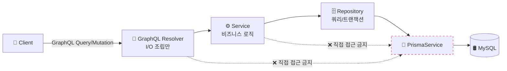
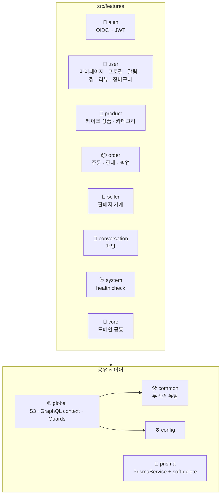
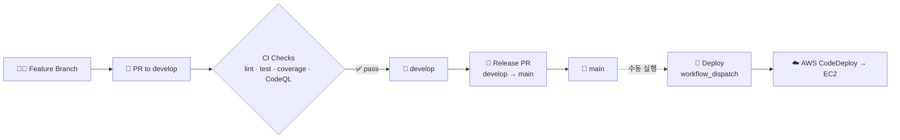

<div align="center">


# 케이퀵 - CaQuick Backend

**시각 기반 올인원 맞춤 케이크 주문 플랫폼**

케이크 디자인 탐색 → 디자인 수정 → 가게 매칭 → 주문·결제·픽업까지<br/>
단절된 모든 과정을 하나의 시각 기반 흐름으로 통합합니다.

<br/>

[](./LICENSE)
[](https://nodejs.org/)
[](https://nestjs.com/)
[](https://www.typescriptlang.org/)

[](https://github.com/CaQuick/caquick-be/actions/workflows/pr-check.yml)
[](https://github.com/CaQuick/caquick-be/actions/workflows/codeql.yml)
[](https://app.codecov.io/gh/CaQuick/caquick-be)
[](https://github.com/CaQuick/caquick-be/commits/develop)

</div>

## 📑 목차

- [기획 배경](#-기획-배경)
- [기술 스택](#-기술-스택)
- [아키텍처](#-아키텍처)
- [디렉터리 구조](#-디렉터리-구조)
- [시작하기](#-시작하기)
- [GraphQL](#-graphql)
- [테스트](#-테스트)
- [CI / CD](#%EF%B8%8F-ci--cd)
- [팀](#-팀)
- [라이선스](#-라이선스)

## 🎯 기획 배경

케이크 디자인 주문은 본질적으로 **맞춤형 상품**이지만, 기존 플랫폼들은 이에 최적화되어 있지 않습니다.

| 채널 | 한계 |
| --- | --- |
| **인스타그램** | 디자인은 풍부하지만 예약/주문 기능 없음 |
| **네이버** | 가게 정보는 있지만 디자인 탐색이 난잡함 |
| **카톡·DM** | 대화만 가능, 시각적 디자인 전달 불가 |

사용자는 결국 **여러 플랫폼을 옮겨 다니며 캡처 + 편집 + 설명을 조합**하는 비효율을 감내해야 합니다.

**케이퀵**은 이 단절된 과정을 시각 기반 단일 흐름으로 통합하는 서비스입니다.

## 🧱 기술 스택

### Language & Runtime


- **TypeScript** (strict) · **Node.js 24.x** · **Yarn 4** (Corepack)

### Framework & API


- **NestJS 11** — Modules · DI · Guards · Interceptors
- **GraphQL** (schema-first SDL) · **Apollo Server 5** · `@nestjs/graphql`
- Doc / codegen 툴체인: **GraphQL Code Generator** (TS 타입 자동생성) · **SpectaQL** (GraphQL HTML 문서) · **Swagger** (REST `/rest-docs`, `@nestjs/swagger`)

### Database & ORM


- **MySQL 8** · **Prisma 6** (ORM + Migrations) · Custom soft-delete extension

### Auth & Validation


- **OIDC** (Google · Kakao) via `openid-client`
- **JWT** (`@nestjs/jwt` + Passport) · **Argon2** (자격 증명 해시)
- `class-validator` · `class-transformer` 기반 DTO 검증

### Testing


- **Jest** + **Testcontainers** (Docker 컨테이너로 실 MySQL 자동 spin-up) + **Supertest**
- DB mock 미사용 — 실 DB 통합 테스트 ([→ 테스트 섹션](#-테스트))

### Code Quality & Security


- **ESLint** (strict) · **Prettier** · **Husky** + **lint-staged**
- **commitlint** (Conventional Commits 강제) · **Codecov** (patch threshold 80%)
- **CodeQL** (GitHub Actions 기반 SAST) · **Dependabot** (의존성 자동 PR · 메이저는 ignore 정책)

### DevOps & Infrastructure

![AWS EC2][aws-ec2]
![AWS RDS][aws-rds]
![AWS S3][aws-s3]
![AWS CodeDeploy][aws-codedeploy]


- **AWS**: EC2 (서버) · RDS MySQL (DB) · S3 + Presigned URL (미디어) · CodeDeploy (배포 자동화)
- **Docker** (compose) — 로컬 개발 + testcontainers
- **Terraform**으로 GitHub repository / branch protection 관리 (IaC)
- **GitHub Actions** — pr-check · deploy · CodeQL · Dependabot
- **PM2** — EC2 프로세스 매니저
- **Discord webhook** — PR · push · issue 이벤트 알림
- **Winston** 구조화 로그 + `x-request-id` 상관관계 추적

## 🏗️ 아키텍처

### 레이어 의존성

요청은 항상 **단방향**으로 흐릅니다. Resolver/Service가 `PrismaService`나 `PrismaClient`에 직접 접근하는 것은 금지되어 있으며, 모든 DB 접근은 Repository를 경유합니다.



### Feature 모듈 구성

도메인별로 폴더가 분리되며 (`src/features/*`), 각 feature는 SDL · Resolver · Service · Repository · DTO · Constants를 colocate합니다. Feature 간에는 서로의 내부 파일을 직접 import하지 않고 **Module export provider**로만 주입받습니다.



### 핵심 설계 원칙

- **의존성 방향 강제**: `Resolver → Service → Repository → Prisma`. 역방향/우회 금지
- **Schema-First GraphQL**: SDL이 단일 소스 (`*.graphql` 파일). 변경 시 `yarn graphql:codegen`으로 타입 동기화
- **Domain Model 격리**: Prisma model 타입을 Resolver/Service에 직접 노출하지 않고 domain 모델/DTO로 매핑
- **Soft-delete 일관성**: `prisma/soft-delete.middleware.ts` Extension이 모든 READ 쿼리에 `deleted_at: null` 자동 주입 (의도적 우회 가능)
- **Fail-fast**: 운영 환경에서 JWT 시크릿 누락 시 서버 부팅 차단. GraphQL Playground 운영에서 비활성

## 📁 디렉터리 구조

```text
caquick-be/
├── src/
│   ├── main.ts                  # 부트스트랩 (NestFactory)
│   ├── app.module.ts            # 루트 모듈
│   ├── features/                # 도메인 모듈 (1 폴더 = 1 도메인)
│   │   ├── auth/                #   OIDC + JWT
│   │   ├── user/                #   마이페이지 · 프로필 · 알림 · 찜 · 리뷰 ...
│   │   ├── product/             #   케이크 상품
│   │   ├── order/               #   주문 · 결제 · 픽업
│   │   ├── seller/              #   판매자 가게
│   │   ├── conversation/        #   채팅
│   │   ├── system/              #   health check
│   │   └── core/                #   도메인 공통
│   ├── common/                  # 무의존 공용 유틸 (외부 의존 X)
│   ├── global/                  # 글로벌 (S3, Guards, GraphQL context)
│   ├── config/                  # 환경별 설정 · 검증
│   ├── prisma/                  # PrismaService · soft-delete extension
│   ├── graphql/                 # codegen 출력 (autogen, 수정 금지)
│   └── test/                    # 테스트 인프라 (factories · helpers)
├── prisma/
│   ├── schema.prisma            # DB 스키마 단일 소스
│   ├── migrations/              # 마이그레이션 히스토리
│   └── seed.ts                  # 시드 스크립트
├── terraform/                   # GitHub repo 설정 IaC
├── .github/
│   ├── workflows/               # GitHub Actions
│   ├── dependabot.yml           # 의존성 자동 업데이트
│   └── assets/                  # README 등 GitHub 노출용 자산
├── scripts/                     # CodeDeploy lifecycle hooks
└── public/                      # SpectaQL HTML 문서 출력
```

## 🚀 시작하기

### Prerequisites

| 항목 | 버전 | 비고 |
| --- | --- | --- |
| Node.js | **24.x** | `nvm install 24` 권장 |
| Yarn | **4.x** (Corepack) | `corepack enable` 한 번 실행 |
| MySQL | **8.x** | 로컬 또는 Docker (`docker-compose.yml` 제공) |
| Docker | latest | 통합 테스트에서 testcontainers가 MySQL 컨테이너를 띄움 |

### 설치 & 실행

```bash
# 1. 의존성 설치
corepack enable
yarn install

# 2. 환경 변수 (루트에 .env 생성, 필요한 키는 .env.example 참고)
cp .env.example .env
# DATABASE_URL · JWT_SECRET · OIDC_* · AWS_* 등 채우기

# 3. DB 마이그레이션
yarn prisma:migrate:dev

# 4. (선택) 시드 데이터 주입
yarn prisma:seed

# 5. 개발 서버 (watch mode)
yarn start:dev
```

기본 GraphQL endpoint: `http://localhost:3000/graphql`

### 자주 쓰는 스크립트

| 명령 | 용도 |
| --- | --- |
| `yarn start:dev` | NestJS watch 모드 |
| `yarn build` | 프로덕션 빌드 (`dist/`) |
| `yarn lint` | ESLint --fix |
| `yarn test` | Jest (실 DB 통합 테스트 포함) |
| `yarn test:cov` | 커버리지 측정 |
| `yarn prisma:migrate:dev` | DB 마이그레이션 생성/적용 |
| `yarn prisma:studio` | Prisma Studio (GUI DB 브라우저) |
| `yarn graphql:codegen` | SDL → TypeScript 타입 생성 |
| `yarn graphql:docs` | SpectaQL HTML 문서 빌드 (`public/`) |

## 🧬 GraphQL

**Schema-First** 방식을 채택합니다. `.graphql` SDL 파일이 단일 소스이며, 변경 시 codegen으로 TypeScript 타입을 동기화합니다.

```graphql
# src/features/user/user-profile.graphql
extend type Query {
  """현재 로그인한 유저 정보 조회"""
  me: MePayload!
}

type MePayload {
  accountId: ID!
  email: String
  accountType: AccountType!
  profile: UserProfile!
  """연동된 소셜 로그인 식별자 목록(soft-deleted 제외, 최근 로그인 순)"""
  linkedIdentities: [LinkedIdentity!]!
}
```

```bash
# SDL 수정 후 항상 codegen 실행
yarn graphql:codegen
```

- 각 도메인은 `extend type Query` / `extend type Mutation` 패턴으로 schema를 확장
- 생성된 타입(`src/graphql/graphql.types.ts`)은 자동 생성물 — 직접 수정 금지
- 운영 환경에서 Apollo Playground는 비활성 (`introspection` off)

## 🧪 테스트

> **DB는 mock하지 않습니다.** 모든 통합 테스트는 [Testcontainers](https://node.testcontainers.org/)로 실제 MySQL 컨테이너를 자동 spin-up한 뒤 Prisma 마이그레이션까지 적용해 검증합니다.

### 왜 실DB로?

- Prisma 쿼리/관계/제약조건 동작이 mock과 미묘하게 다를 수 있어, mock이 통과해도 운영 마이그레이션이 깨지는 케이스를 사전에 잡습니다
- soft-delete extension이 `where`에 자동 주입되는 동작 등 **ORM 레이어 통합 동작**을 검증
- 트랜잭션 격리, 유니크 제약, 외래 키 cascade 동작까지 실제 DB 의미론으로 확인

### 테스트 레이어

| 레이어 | 목적 |
| --- | --- |
| `*.service.spec.ts` | 단위 + 실 DB. 분기/예외/도메인 로직 |
| `*.resolver.spec.ts` | Resolver ↔ Service ↔ Repository ↔ DB 전체 경로 통합 (1~2 happy/error 케이스) |
| `*.repository.spec.ts` | Repository 단위에서만 도달 가능한 API contract |

```bash
# 전체 실행 (testcontainers가 MySQL 컨테이너를 띄움 — Docker 필요)
yarn test

# 특정 도메인만
yarn test src/features/user

# 커버리지 (patch threshold 80%)
yarn test:cov
```

CI에서도 동일하게 testcontainers로 격리된 MySQL을 띄우므로 로컬과 환경 차이가 거의 없습니다.

## ⚙️ CI / CD

### 워크플로우

| Workflow | Trigger | 역할 |
| --- | --- | --- |
| `pr-check.yml` | PR (develop/main) | lint · typecheck · 통합 테스트 · 커버리지 |
| `codeql.yml` | PR · push · 주간 | GitHub CodeQL SAST |
| `discord-notify.yml` | PR · push · issue | Discord 알림 |
| `deploy.yml` | **수동** (`workflow_dispatch`) | EC2 + RDS 인프라 비활성 기간 동안 자동 배포 중단 |

### 흐름



### 브랜치 보호

- **main**: PR + CI 통과 필수. 직접 push 금지
- **develop**: PR + CI 통과 권장. Repository Admin은 release sync 목적으로 fast-forward 직접 push 가능
- 필수 status check: `check`, `pr-title`, `coverage-report`, `Analyze (javascript-typescript)`
- 브랜치 보호 / 레포 설정은 [`terraform/`](./terraform/)에서 IaC로 관리

## 👤 팀

<table>
  <tr>
    <td align="center">
      <a href="https://github.com/chanwoo7">
        <br/>
        <sub><b>chanwoo7</b></sub>
      </a>
      <br/>
      <sub>Backend Developer</sub>
    </td>
  </tr>
</table>

## 📜 라이선스

이 프로젝트는 **Business Source License 1.1 (BUSL-1.1)** 으로 배포됩니다.

- 비상업적 / 학습 / 평가 목적의 사용은 자유롭게 허용됩니다
- **케이크 주문 플랫폼과 경쟁하는 상업 서비스**로의 이용은 별도 라이선스 협의가 필요합니다
- Change Date(`2030-05-20`) 이후 **Apache License 2.0**으로 자동 전환됩니다

전체 조항은 [LICENSE](./LICENSE) 파일을 참고하세요.

Copyright © 2026 CaQuick. All rights reserved.

<!-- ─────────────────────────────────────────────────────────
     AWS service badge 정의 (base64-embedded SVG icons)
     SVG 출처: gilbarbara/logos (MIT) — .github/assets/aws/
     ───────────────────────────────────────────────────────── -->
[aws-ec2]: https://img.shields.io/badge/AWS%20EC2-FF9900?style=flat&logo=data:image/svg+xml;base64,PD94bWwgdmVyc2lvbj0iMS4wIiBlbmNvZGluZz0iVVRGLTgiPz4KPHN2ZyB3aWR0aD0iMjU2cHgiIGhlaWdodD0iMjU2cHgiIHZpZXdCb3g9IjAgMCAyNTYgMjU2IiB2ZXJzaW9uPSIxLjEiIHhtbG5zPSJodHRwOi8vd3d3LnczLm9yZy8yMDAwL3N2ZyIgeG1sbnM6eGxpbms9Imh0dHA6Ly93d3cudzMub3JnLzE5OTkveGxpbmsiIHByZXNlcnZlQXNwZWN0UmF0aW89InhNaWRZTWlkIj4KICAgIDx0aXRsZT5BV1MgRWxhc3RpYyBDb21wdXRlIENsb3VkIChFQzIpPC90aXRsZT4KICAgIDxkZWZzPgogICAgICAgIDxsaW5lYXJHcmFkaWVudCB4MT0iMCUiIHkxPSIxMDAlIiB4Mj0iMTAwJSIgeTI9IjAlIiBpZD0ibGluZWFyR3JhZGllbnQtMSI+CiAgICAgICAgICAgIDxzdG9wIHN0b3AtY29sb3I9IiNDODUxMUIiIG9mZnNldD0iMCUiPjwvc3RvcD4KICAgICAgICAgICAgPHN0b3Agc3RvcC1jb2xvcj0iI0ZGOTkwMCIgb2Zmc2V0PSIxMDAlIj48L3N0b3A+CiAgICAgICAgPC9saW5lYXJHcmFkaWVudD4KICAgIDwvZGVmcz4KICAgIDxnPgogICAgICAgIDxyZWN0IGZpbGw9InVybCgjbGluZWFyR3JhZGllbnQtMSkiIHg9IjAiIHk9IjAiIHdpZHRoPSIyNTYiIGhlaWdodD0iMjU2Ij48L3JlY3Q+CiAgICAgICAgPHBhdGggZD0iTTg2LjQsMTY5LjYgTDE2Ni40LDE2OS42IEwxNjYuNCw4OS42IEw4Ni40LDg5LjYgTDg2LjQsMTY5LjYgWiBNMTcyLjgsODkuNiBMMTg1LjYsODkuNiBMMTg1LjYsOTYgTDE3Mi44LDk2IEwxNzIuOCwxMDguOCBMMTg1LjYsMTA4LjggTDE4NS42LDExNS4yIEwxNzIuOCwxMTUuMiBMMTcyLjgsMTI0LjggTDE4NS42LDEyNC44IEwxODUuNiwxMzEuMiBMMTcyLjgsMTMxLjIgTDE3Mi44LDE0NCBMMTg1LjYsMTQ0IEwxODUuNiwxNTAuNCBMMTcyLjgsMTUwLjQgTDE3Mi44LDE2My4yIEwxODUuNiwxNjMuMiBMMTg1LjYsMTY5LjYgTDE3Mi44LDE2OS42IEwxNzIuOCwxNzAuMDM1MiBDMTcyLjgsMTczLjMyNDggMTcwLjEyNDgsMTc2IDE2Ni44MzUyLDE3NiBMMTY2LjQsMTc2IEwxNjYuNCwxODguOCBMMTYwLDE4OC44IEwxNjAsMTc2IEwxNDcuMiwxNzYgTDE0Ny4yLDE4OC44IEwxNDAuOCwxODguOCBMMTQwLjgsMTc2IEwxMzEuMiwxNzYgTDEzMS4yLDE4OC44IEwxMjQuOCwxODguOCBMMTI0LjgsMTc2IEwxMTIsMTc2IEwxMTIsMTg4LjggTDEwNS42LDE4OC44IEwxMDUuNiwxNzYgTDkyLjgsMTc2IEw5Mi44LDE4OC44IEw4Ni40LDE4OC44IEw4Ni40LDE3NiBMODUuOTY0OCwxNzYgQzgyLjY3NTIsMTc2IDgwLDE3My4zMjQ4IDgwLDE3MC4wMzUyIEw4MCwxNjkuNiBMNzAuNCwxNjkuNiBMNzAuNCwxNjMuMiBMODAsMTYzLjIgTDgwLDE1MC40IEw3MC40LDE1MC40IEw3MC40LDE0NCBMODAsMTQ0IEw4MCwxMzEuMiBMNzAuNCwxMzEuMiBMNzAuNCwxMjQuOCBMODAsMTI0LjggTDgwLDExNS4yIEw3MC40LDExNS4yIEw3MC40LDEwOC44IEw4MCwxMDguOCBMODAsOTYgTDcwLjQsOTYgTDcwLjQsODkuNiBMODAsODkuNiBMODAsODkuMTY0OCBDODAsODUuODc1MiA4Mi42NzUyLDgzLjIgODUuOTY0OCw4My4yIEw4Ni40LDgzLjIgTDg2LjQsNzAuNCBMOTIuOCw3MC40IEw5Mi44LDgzLjIgTDEwNS42LDgzLjIgTDEwNS42LDcwLjQgTDExMiw3MC40IEwxMTIsODMuMiBMMTI0LjgsODMuMiBMMTI0LjgsNzAuNCBMMTMxLjIsNzAuNCBMMTMxLjIsODMuMiBMMTQwLjgsODMuMiBMMTQwLjgsNzAuNCBMMTQ3LjIsNzAuNCBMMTQ3LjIsODMuMiBMMTYwLDgzLjIgTDE2MCw3MC40IEwxNjYuNCw3MC40IEwxNjYuNCw4My4yIEwxNjYuODM1Miw4My4yIEMxNzAuMTI0OCw4My4yIDE3Mi44LDg1Ljg3NTIgMTcyLjgsODkuMTY0OCBMMTcyLjgsODkuNiBaIE0xMzEuMiwyMTAuODAzMiBDMTMxLjIsMjExLjAyMDggMTMxLjAyMDgsMjExLjIgMTMwLjgwMzIsMjExLjIgTDQ1LjE5NjgsMjExLjIgQzQ0Ljk3OTIsMjExLjIgNDQuOCwyMTEuMDIwOCA0NC44LDIxMC44MDMyIEw0NC44LDEyNS4xOTY4IEM0NC44LDEyNC45NzkyIDQ0Ljk3OTIsMTI0LjggNDUuMTk2OCwxMjQuOCBMNjQsMTI0LjggTDY0LDExOC40IEw0NS4xOTY4LDExOC40IEM0MS40NDk2LDExOC40IDM4LjQsMTIxLjQ0OTYgMzguNCwxMjUuMTk2OCBMMzguNCwyMTAuODAzMiBDMzguNCwyMTQuNTUwNCA0MS40NDk2LDIxNy42IDQ1LjE5NjgsMjE3LjYgTDEzMC44MDMyLDIxNy42IEMxMzQuNTUwNCwyMTcuNiAxMzcuNiwyMTQuNTUwNCAxMzcuNiwyMTAuODAzMiBMMTM3LjYsMTk1LjIgTDEzMS4yLDE5NS4yIEwxMzEuMiwyMTAuODAzMiBaIE0yMTcuNiw0NS4xOTY4IEwyMTcuNiwxMzAuODAzMiBDMjE3LjYsMTM0LjU1MDQgMjE0LjU1MDQsMTM3LjYgMjEwLjgwMzIsMTM3LjYgTDE5MiwxMzcuNiBMMTkyLDEzMS4yIEwyMTAuODAzMiwxMzEuMiBDMjExLjAyMDgsMTMxLjIgMjExLjIsMTMxLjAyMDggMjExLjIsMTMwLjgwMzIgTDIxMS4yLDQ1LjE5NjggQzIxMS4yLDQ0Ljk3OTIgMjExLjAyMDgsNDQuOCAyMTAuODAzMiw0NC44IEwxMjUuMTk2OCw0NC44IEMxMjQuOTc5Miw0NC44IDEyNC44LDQ0Ljk3OTIgMTI0LjgsNDUuMTk2OCBMMTI0LjgsNjQgTDExOC40LDY0IEwxMTguNCw0NS4xOTY4IEMxMTguNCw0MS40NDk2IDEyMS40NDk2LDM4LjQgMTI1LjE5NjgsMzguNCBMMjEwLjgwMzIsMzguNCBDMjE0LjU1MDQsMzguNCAyMTcuNiw0MS40NDk2IDIxNy42LDQ1LjE5NjggTDIxNy42LDQ1LjE5NjggWiIgZmlsbD0iI0ZGRkZGRiI+PC9wYXRoPgogICAgPC9nPgo8L3N2Zz4=
[aws-rds]: https://img.shields.io/badge/AWS%20RDS-3B48CC?style=flat&logo=data:image/svg+xml;base64,PD94bWwgdmVyc2lvbj0iMS4wIiBlbmNvZGluZz0iVVRGLTgiPz4KPHN2ZyB3aWR0aD0iMjU2cHgiIGhlaWdodD0iMjU2cHgiIHZpZXdCb3g9IjAgMCAyNTYgMjU2IiB2ZXJzaW9uPSIxLjEiIHhtbG5zPSJodHRwOi8vd3d3LnczLm9yZy8yMDAwL3N2ZyIgeG1sbnM6eGxpbms9Imh0dHA6Ly93d3cudzMub3JnLzE5OTkveGxpbmsiIHByZXNlcnZlQXNwZWN0UmF0aW89InhNaWRZTWlkIj4KICAgIDx0aXRsZT5BV1MgUmVsYXRpb25hbCBEYXRhYmFzZSBTZXJ2aWNlIChSRFMpPC90aXRsZT4KICAgIDxkZWZzPgogICAgICAgIDxsaW5lYXJHcmFkaWVudCB4MT0iMCUiIHkxPSIxMDAlIiB4Mj0iMTAwJSIgeTI9IjAlIiBpZD0ibGluZWFyR3JhZGllbnQtMSI+CiAgICAgICAgICAgIDxzdG9wIHN0b3AtY29sb3I9IiMyRTI3QUQiIG9mZnNldD0iMCUiPjwvc3RvcD4KICAgICAgICAgICAgPHN0b3Agc3RvcC1jb2xvcj0iIzUyN0ZGRiIgb2Zmc2V0PSIxMDAlIj48L3N0b3A+CiAgICAgICAgPC9saW5lYXJHcmFkaWVudD4KICAgIDwvZGVmcz4KICAgIDxnPgogICAgICAgIDxyZWN0IGZpbGw9InVybCgjbGluZWFyR3JhZGllbnQtMSkiIHg9IjAiIHk9IjAiIHdpZHRoPSIyNTYiIGhlaWdodD0iMjU2Ij48L3JlY3Q+CiAgICAgICAgPHBhdGggZD0iTTQ5LjMyNDgsNDQuOCBMNzkuMDYyNCw3NC41Mzc2IEw3NC41Mzc2LDc5LjA2MjQgTDQ0LjgsNDkuMzI0OCBMNDQuOCw3My42IEwzOC40LDczLjYgTDM4LjQsNDEuNiBDMzguNCwzOS44MzM2IDM5LjgzMDQsMzguNCA0MS42LDM4LjQgTDczLjYsMzguNCBMNzMuNiw0NC44IEw0OS4zMjQ4LDQ0LjggWiBNMjE3LjYsNDEuNiBMMjE3LjYsNzMuNiBMMjExLjIsNzMuNiBMMjExLjIsNDkuMzI0OCBMMTgxLjQ2MjQsNzkuMDYyNCBMMTc2LjkzNzYsNzQuNTM3NiBMMjA2LjY3NTIsNDQuOCBMMTgyLjQsNDQuOCBMMTgyLjQsMzguNCBMMjE0LjQsMzguNCBDMjE2LjE2OTYsMzguNCAyMTcuNiwzOS44MzM2IDIxNy42LDQxLjYgTDIxNy42LDQxLjYgWiBNMjExLjIsMTgyLjQgTDIxNy42LDE4Mi40IEwyMTcuNiwyMTQuNCBDMjE3LjYsMjE2LjE2NjQgMjE2LjE2OTYsMjE3LjYgMjE0LjQsMjE3LjYgTDE4Mi40LDIxNy42IEwxODIuNCwyMTEuMiBMMjA2LjY3NTIsMjExLjIgTDE3Ni45Mzc2LDE4MS40NjI0IEwxODEuNDYyNCwxNzYuOTM3NiBMMjExLjIsMjA2LjY3NTIgTDIxMS4yLDE4Mi40IFogTTIwOS42LDEyNS40ODE2IEMyMDkuNiwxMTQuODYwOCAxOTcuMzM3NiwxMDQuMzY4IDE3Ni44LDk3LjQxNDQgTDE3OC44NTEyLDkxLjM1MzYgQzIwMi40NTc2LDk5LjM0NCAyMTYsMTExLjc4MjQgMjE2LDEyNS40ODE2IEMyMTYsMTM5LjE4NCAyMDIuNDU3NiwxNTEuNjI1NiAxNzguODQ4LDE1OS42MTI4IEwxNzYuNzk2OCwxNTMuNTQ4OCBDMTk3LjMzNzYsMTQ2LjU5ODQgMjA5LjYsMTM2LjEwODggMjA5LjYsMTI1LjQ4MTYgTDIwOS42LDEyNS40ODE2IFogTTQ2LjU3OTIsMTI1LjQ4MTYgQzQ2LjU3OTIsMTM1LjY1NzYgNTguMDU3NiwxNDUuODcyIDc3LjI4NjQsMTUyLjgwOTYgTDc1LjExMzYsMTU4LjgyODggQzUyLjkxMiwxNTAuODE5MiA0MC4xNzkyLDEzOC42NjU2IDQwLjE3OTIsMTI1LjQ4MTYgQzQwLjE3OTIsMTEyLjMwMDggNTIuOTEyLDEwMC4xNDcyIDc1LjExMzYsOTIuMTM0NCBMNzcuMjg2NCw5OC4xNTM2IEM1OC4wNTc2LDEwNS4wOTQ0IDQ2LjU3OTIsMTE1LjMwODggNDYuNTc5MiwxMjUuNDgxNiBMNDYuNTc5MiwxMjUuNDgxNiBaIE03OS4wNjI0LDE4MS40NjI0IEw0OS4zMjQ4LDIxMS4yIEw3My42LDIxMS4yIEw3My42LDIxNy42IEw0MS42LDIxNy42IEMzOS44MzA0LDIxNy42IDM4LjQsMjE2LjE2NjQgMzguNCwyMTQuNCBMMzguNCwxODIuNCBMNDQuOCwxODIuNCBMNDQuOCwyMDYuNjc1MiBMNzQuNTM3NiwxNzYuOTM3NiBMNzkuMDYyNCwxODEuNDYyNCBaIE0xMjgsMTAwLjExNTIgQzEwNS4xMzI4LDEwMC4xMTUyIDkyLjgsOTQuMjA4IDkyLjgsOTEuNzk1MiBDOTIuOCw4OS4zNzkyIDEwNS4xMzI4LDgzLjQ3NTIgMTI4LDgzLjQ3NTIgQzE1MC44NjQsODMuNDc1MiAxNjMuMiw4OS4zNzkyIDE2My4yLDkxLjc5NTIgQzE2My4yLDk0LjIwOCAxNTAuODY0LDEwMC4xMTUyIDEyOCwxMDAuMTE1MiBMMTI4LDEwMC4xMTUyIFogTTEyOC4wOTI4LDEyNC44OTkyIEMxMDYuMTk4NCwxMjQuODk5MiA5Mi44LDExOC45MTg0IDkyLjgsMTE1LjY2NCBMOTIuOCwxMDAuMTA4OCBDMTAwLjY4MTYsMTA0LjQ1NzYgMTE0LjY2MjQsMTA2LjUxNTIgMTI4LDEwNi41MTUyIEMxNDEuMzM3NiwxMDYuNTE1MiAxNTUuMzE4NCwxMDQuNDU3NiAxNjMuMiwxMDAuMTA4OCBMMTYzLjIsMTE1LjY2NCBDMTYzLjIsMTE4LjkyMTYgMTQ5Ljg3MiwxMjQuODk5MiAxMjguMDkyOCwxMjQuODk5MiBMMTI4LjA5MjgsMTI0Ljg5OTIgWiBNMTI4LjA5MjgsMTQ5LjMzNDQgQzEwNi4xOTg0LDE0OS4zMzQ0IDkyLjgsMTQzLjM1MzYgOTIuOCwxNDAuMDk5MiBMOTIuOCwxMjQuMzU4NCBDMTAwLjU3OTIsMTI4LjkzMTIgMTE0LjM3NDQsMTMxLjI5OTIgMTI4LjA5MjgsMTMxLjI5OTIgQzE0MS43MzQ0LDEzMS4yOTkyIDE1NS40NDk2LDEyOC45MzQ0IDE2My4yLDEyNC4zNzQ0IEwxNjMuMiwxNDAuMDk5MiBDMTYzLjIsMTQzLjM1NjggMTQ5Ljg3MiwxNDkuMzM0NCAxMjguMDkyOCwxNDkuMzM0NCBMMTI4LjA5MjgsMTQ5LjMzNDQgWiBNMTI4LDE3MS4yNTc2IEMxMDUuMjI1NiwxNzEuMjU3NiA5Mi44LDE2NS4xMzYgOTIuOCwxNjEuOTkwNCBMOTIuOCwxNDguNzkzNiBDMTAwLjU3OTIsMTUzLjM2NjQgMTE0LjM3NDQsMTU1LjczNDQgMTI4LjA5MjgsMTU1LjczNDQgQzE0MS43MzQ0LDE1NS43MzQ0IDE1NS40NDk2LDE1My4zNzI4IDE2My4yLDE0OC44MDk2IEwxNjMuMiwxNjEuOTkwNCBDMTYzLjIsMTY1LjEzNiAxNTAuNzc0NCwxNzEuMjU3NiAxMjgsMTcxLjI1NzYgTDEyOCwxNzEuMjU3NiBaIE0xMjgsNzcuMDc1MiBDMTA3Ljk2NDgsNzcuMDc1MiA4Ni40LDgxLjY4IDg2LjQsOTEuNzk1MiBMODYuNCwxNjEuOTkwNCBDODYuNCwxNzIuMjc1MiAxMDcuMzI4LDE3Ny42NTc2IDEyOCwxNzcuNjU3NiBDMTQ4LjY3MiwxNzcuNjU3NiAxNjkuNiwxNzIuMjc1MiAxNjkuNiwxNjEuOTkwNCBMMTY5LjYsOTEuNzk1MiBDMTY5LjYsODEuNjggMTQ4LjAzNTIsNzcuMDc1MiAxMjgsNzcuMDc1MiBMMTI4LDc3LjA3NTIgWiIgZmlsbD0iI0ZGRkZGRiI+PC9wYXRoPgogICAgPC9nPgo8L3N2Zz4=
[aws-s3]: https://img.shields.io/badge/AWS%20S3-569A31?style=flat&logo=data:image/svg+xml;base64,PD94bWwgdmVyc2lvbj0iMS4wIiBlbmNvZGluZz0iVVRGLTgiPz4KPHN2ZyB3aWR0aD0iMjU2cHgiIGhlaWdodD0iMjU2cHgiIHZpZXdCb3g9IjAgMCAyNTYgMjU2IiB2ZXJzaW9uPSIxLjEiIHhtbG5zPSJodHRwOi8vd3d3LnczLm9yZy8yMDAwL3N2ZyIgeG1sbnM6eGxpbms9Imh0dHA6Ly93d3cudzMub3JnLzE5OTkveGxpbmsiIHByZXNlcnZlQXNwZWN0UmF0aW89InhNaWRZTWlkIj4KICAgIDx0aXRsZT5BV1MgU2ltcGxlIFN0b3JhZ2UgU2VydmljZSAoUzMpPC90aXRsZT4KICAgIDxkZWZzPgogICAgICAgIDxsaW5lYXJHcmFkaWVudCB4MT0iMCUiIHkxPSIxMDAlIiB4Mj0iMTAwJSIgeTI9IjAlIiBpZD0ibGluZWFyR3JhZGllbnQtMSI+CiAgICAgICAgICAgIDxzdG9wIHN0b3AtY29sb3I9IiMxQjY2MEYiIG9mZnNldD0iMCUiPjwvc3RvcD4KICAgICAgICAgICAgPHN0b3Agc3RvcC1jb2xvcj0iIzZDQUUzRSIgb2Zmc2V0PSIxMDAlIj48L3N0b3A+CiAgICAgICAgPC9saW5lYXJHcmFkaWVudD4KICAgIDwvZGVmcz4KICAgIDxnPgogICAgICAgIDxyZWN0IGZpbGw9InVybCgjbGluZWFyR3JhZGllbnQtMSkiIHg9IjAiIHk9IjAiIHdpZHRoPSIyNTYiIGhlaWdodD0iMjU2Ij48L3JlY3Q+CiAgICAgICAgPHBhdGggZD0iTTE5NC42NzQ4OCwxMzcuMjU2MzIgTDE5NS45MDM2OCwxMjguNjAzNTIgQzIwNy4yMzQ4OCwxMzUuMzkwNzIgMjA3LjM4MjA4LDEzOC4xOTM5MiAyMDcuMzc4OTY0LDEzOC4yNzA3MiBDMjA3LjM1OTY4LDEzOC4yODY3MiAyMDUuNDI2ODgsMTM5Ljg5OTUyIDE5NC42NzQ4OCwxMzcuMjU2MzIgTDE5NC42NzQ4OCwxMzcuMjU2MzIgWiBNMTg4LjQ1NzI4LDEzNS41MjgzMiBDMTY4Ljg3MzI4LDEyOS42MDE5MiAxNDEuNTk5NjgsMTE3LjA4OTkyIDEzMC41NjI4OCwxMTEuODczOTIgQzEzMC41NjI4OCwxMTEuODI5MTIgMTMwLjU3NTY4LDExMS43ODc1MiAxMzAuNTc1NjgsMTExLjc0MjcyIEMxMzAuNTc1NjgsMTA3LjUwMjcyIDEyNy4xMjYwOCwxMDQuMDUzMTIgMTIyLjg4Mjg4LDEwNC4wNTMxMiBDMTE4LjY0NjA4LDEwNC4wNTMxMiAxMTUuMTk2NDgsMTA3LjUwMjcyIDExNS4xOTY0OCwxMTEuNzQyNzIgQzExNS4xOTY0OCwxMTUuOTgyNzIgMTE4LjY0NjA4LDExOS40MzIzMiAxMjIuODgyODgsMTE5LjQzMjMyIEMxMjQuNzQ1MjgsMTE5LjQzMjMyIDEyNi40MzQ4OCwxMTguNzM3OTIgMTI3Ljc2OTI4LDExNy42MzM5MiBDMTQwLjc1NDg4LDEyMy43ODExMiAxNjcuODE3MjgsMTM2LjExMDcyIDE4Ny41NDUyOCwxNDEuOTM0NzIgTDE3OS43NDM2OCwxOTYuOTkzOTIgQzE3OS43MjEyOCwxOTcuMTQ0MzIgMTc5LjcxMTY4LDE5Ny4yOTQ3MiAxNzkuNzExNjgsMTk3LjQ0NTEyIEMxNzkuNzExNjgsMjAyLjI5MzEyIDE1OC4yNDkyOCwyMTEuMTk4NzIgMTIzLjE4MDQ4LDIxMS4xOTg3MiBDODcuNzQwNDgsMjExLjE5ODcyIDY2LjA1MDg4LDIwMi4yOTMxMiA2Ni4wNTA4OCwxOTcuNDQ1MTIgQzY2LjA1MDg4LDE5Ny4yOTc5MiA2Ni4wNDEyOCwxOTcuMTUzOTIgNjYuMDIyMDgsMTk3LjAwOTkyIEw0OS43MjEyOCw3Ny45NDc1MiBDNjMuODMwMDgsODcuNjU5NTIgOTQuMTc1NjgsOTIuNzk4NzIgMTIzLjE5OTY4LDkyLjc5ODcyIEMxNTIuMTc4ODgsOTIuNzk4NzIgMTgyLjQ3MzI4LDg3LjY3ODcyIDE5Ni42MTA4OCw3Ny45OTU1MiBMMTg4LjQ1NzI4LDEzNS41MjgzMiBaIE00Ny45OTk2OCw2NS41MjgzMiBDNDguMjMwMDgsNjEuMzE3MTIgNzIuNDI4NDgsNDQuNzk4NzIgMTIzLjE5OTY4LDQ0Ljc5ODcyIEMxNzMuOTY0NDgsNDQuNzk4NzIgMTk4LjE2NjA4LDYxLjMxMzkyIDE5OC4zOTk2OCw2NS41MjgzMiBMMTk4LjM5OTY4LDY2Ljk2NTEyIEMxOTUuNjE1NjgsNzYuNDA4MzIgMTY0LjI1NTY4LDg2LjM5ODcyIDEyMy4xOTk2OCw4Ni4zOTg3MiBDODIuMDczMjgsODYuMzk4NzIgNTAuNjk3MjgsNzYuMzc2MzIgNDcuOTk5NjgsNjYuOTIwMzIgTDQ3Ljk5OTY4LDY1LjUyODMyIFogTTIwNC43OTk2OCw2NS41OTg3MiBDMjA0Ljc5OTY4LDU0LjUxMDcyIDE3My4wMTA4OCwzOC4zOTg3MiAxMjMuMTk5NjgsMzguMzk4NzIgQzczLjM4ODQ4LDM4LjM5ODcyIDQxLjU5OTY4LDU0LjUxMDcyIDQxLjU5OTY4LDY1LjU5ODcyIEw0MS45MDA0OCw2OC4wMTE1MiBMNTkuNjU0MDgsMTk3LjY4ODMyIEM2MC4wNzk2OCwyMTIuMTkwNzIgOTguNzU0ODgsMjE3LjU5ODcyIDEyMy4xODA0OCwyMTcuNTk4NzIgQzE1My40OTA4OCwyMTcuNTk4NzIgMTg1LjY5MjQ4LDIxMC42MjkxMiAxODYuMTA4NDgsMTk3LjY5NzkyIEwxOTMuNzc1NjgsMTQzLjYyNzUyIEMxOTguMDQxMjgsMTQ0LjY0ODMyIDIwMS41NTE2OCwxNDUuMTY5OTIgMjA0LjM3MDg4LDE0NS4xNjk5MiBDMjA4LjE1NjQ4LDE0NS4xNjk5MiAyMTAuNzE2NDgsMTQ0LjI0NTEyIDIxMi4yNjg0OCwxNDIuMzk1NTIgQzIxMy41NDIwOCwxNDAuODc4NzIgMjE0LjAyODQ4LDEzOS4wNDE5MiAyMTMuNjYzNjgsMTM3LjA4NjcyIEMyMTIuODM0ODgsMTMyLjY1NzkyIDIwNy41NzcyOCwxMjcuODgzNTIgMTk2Ljg3MDA4LDEyMS43NzQ3MiBMMjA0LjQ3MzI4LDY4LjEzNjMyIEwyMDQuNzk5NjgsNjUuNTk4NzIgWiIgZmlsbD0iI0ZGRkZGRiI+PC9wYXRoPgogICAgPC9nPgo8L3N2Zz4=
[aws-codedeploy]: https://img.shields.io/badge/AWS%20CodeDeploy-4D27AA?style=flat&logo=data:image/svg+xml;base64,PD94bWwgdmVyc2lvbj0iMS4wIiBlbmNvZGluZz0iVVRGLTgiPz4KPHN2ZyB3aWR0aD0iMjU2cHgiIGhlaWdodD0iMjU2cHgiIHZpZXdCb3g9IjAgMCAyNTYgMjU2IiB2ZXJzaW9uPSIxLjEiIHhtbG5zPSJodHRwOi8vd3d3LnczLm9yZy8yMDAwL3N2ZyIgeG1sbnM6eGxpbms9Imh0dHA6Ly93d3cudzMub3JnLzE5OTkveGxpbmsiIHByZXNlcnZlQXNwZWN0UmF0aW89InhNaWRZTWlkIj4KICAgIDx0aXRsZT5BV1MgQ29kZURlcGxveTwvdGl0bGU+CiAgICA8ZGVmcz4KICAgICAgICA8bGluZWFyR3JhZGllbnQgeDE9IjAlIiB5MT0iMTAwJSIgeDI9IjEwMCUiIHkyPSIwJSIgaWQ9ImxpbmVhckdyYWRpZW50LTEiPgogICAgICAgICAgICA8c3RvcCBzdG9wLWNvbG9yPSIjMkUyN0FEIiBvZmZzZXQ9IjAlIj48L3N0b3A+CiAgICAgICAgICAgIDxzdG9wIHN0b3AtY29sb3I9IiM1MjdGRkYiIG9mZnNldD0iMTAwJSI+PC9zdG9wPgogICAgICAgIDwvbGluZWFyR3JhZGllbnQ+CiAgICA8L2RlZnM+CiAgICA8Zz4KICAgICAgICA8cmVjdCBmaWxsPSJ1cmwoI2xpbmVhckdyYWRpZW50LTEpIiB4PSIwIiB5PSIwIiB3aWR0aD0iMjU2IiBoZWlnaHQ9IjI1NiI+PC9yZWN0PgogICAgICAgIDxwYXRoIGQ9Ik04OS42MDA5OTcxLDIxNC4zNDMzNjMgTDE3Mi44MDQ0MTUsMjE0LjM0MzM2MyBMMTcyLjgwNDQxNSwxNTkuNDYxOTQ3IEw4OS42MDA5OTcxLDE1OS40NjE5NDcgTDg5LjYwMDk5NzEsMjE0LjM0MzM2MyBaIE0xNzYuMDA0NTQ3LDE1My4wMDUzMSBMODYuNDAwODY1NiwxNTMuMDA1MzEgQzg0LjYzMTE5MywxNTMuMDA1MzEgODMuMjAwNzM0MSwxNTQuNDUxNTk2IDgzLjIwMDczNDEsMTU2LjIzMzYyOCBMODMuMjAwNzM0MSwyMTcuNTcxNjgxIEM4My4yMDA3MzQxLDIxOS4zNTM3MTMgODQuNjMxMTkzLDIyMC44IDg2LjQwMDg2NTYsMjIwLjggTDE3Ni4wMDQ1NDcsMjIwLjggQzE3Ny43NzQyMTksMjIwLjggMTc5LjIwNDY3OCwyMTkuMzUzNzEzIDE3OS4yMDQ2NzgsMjE3LjU3MTY4MSBMMTc5LjIwNDY3OCwxNTYuMjMzNjI4IEMxNzkuMjA0Njc4LDE1NC40NTE1OTYgMTc3Ljc3NDIxOSwxNTMuMDA1MzEgMTc2LjAwNDU0NywxNTMuMDA1MzEgTDE3Ni4wMDQ1NDcsMTUzLjAwNTMxIFogTTExOC43MDYxOTMsMjA4LjYzNTY5NiBMMTM4LjA4NjE4OSwxNjQuMjQ2MzE1IEwxNDMuOTQyNDI5LDE2Ni44NTE1NjggTDEyNC41NjI0MzMsMjExLjI0MDk0OSBMMTE4LjcwNjE5MywyMDguNjM1Njk2IFogTTE1NS4zMTg4OTcsMTg3LjIzNTE3MiBMMTQ0LjQxOTI0OSwxNzYuNTMzMjk2IEwxNDguODgwMjMyLDE3MS45MDM4ODcgTDE2Mi40Njc5OSwxODUuMjQzMjk5IEMxNjMuMTM2ODE4LDE4NS45MDE4NzYgMTYzLjQ4ODgzMiwxODYuODI1MTc1IDE2My40MjgwMywxODcuNzY3ODQ0IEMxNjMuMzY3MjI4LDE4OC43MTA1MTMgMTYyLjkwMDAwOCwxODkuNTc4OTMxIDE2Mi4xNTExNzcsMTkwLjE0Mzg4NyBMMTQ2Ljk2MDE1MywyMDEuNjAxMTg5IEwxNDMuMTI5NTk2LDE5Ni40MzI2NTEgTDE1NS4zMTg4OTcsMTg3LjIzNTE3MiBaIE0xMDAuNDQ5NDQzLDE4Ni4xMDg0ODkgQzk5Ljc3NzQxNSwxODUuNDQ5OTExIDk5LjQyNTQwMDYsMTg0LjUyOTg0MSA5OS40ODYyMDMyLDE4My41ODcxNzIgQzk5LjU0NzAwNTgsMTgyLjY0NDUwMyAxMDAuMDE0MjI1LDE4MS43NzYwODUgMTAwLjc2MzA1NiwxODEuMjExMTI5IEwxMTUuOTU0MDgsMTY5Ljc1MzgyNyBMMTE5Ljc4NzgzNywxNzQuOTIyMzY0IEwxMDcuNTk1MzM2LDE4NC4xMTY2MTYgTDExOC40OTgxODQsMTk0LjgyMTcyIEwxMTQuMDM3MjAxLDE5OS40NTExMjkgTDEwMC40NDk0NDMsMTg2LjEwODQ4OSBaIE0yMTEuMzQwMzk4LDExMi4xNjA2MjMgQzIwNS4xOTkzNDYsMTA2LjE2ODg2NCAxOTcuMDI5NDEsMTAyLjg2OTUyMiAxODguMzM0NjUzLDEwMi44Njk1MjIgQzE3Ni45OTk3ODgsMTAyLjg2OTUyMiAxNjcuNzQxODA3LDEwNi45MDQ5MiAxNjIuMDAzOTcyLDExMy42MjMwNTEgQzE2MC41OTU5MTQsODIuNjg2MDc0MiAxNTMuNTIzNjIzLDU3Ljc5NTczNzkgMTQzLjQxMTIwOCw0NS45NDEzNTIzIEMxNzkuNjA0Njk0LDUxLjQxMDEyMzggMjA3LjA3NDYyMyw3OC4xNTAyODY3IDIxMy4xNTE2NzIsMTEzLjk0NTg4MyBDMjEyLjU1MzI0OCwxMTMuMzQ1NDE2IDIxMS45NDUyMjMsMTEyLjc1MTQwNSAyMTEuMzQwMzk4LDExMi4xNjA2MjMgTDIxMS4zNDAzOTgsMTEyLjE2MDYyMyBaIE0xNTMuODExNjM1LDExMy4yNzExNjQgTDE1Mi42NjU5ODgsMTEyLjE2MDYyMyBDMTQ2LjUyNDkzNSwxMDYuMTY4ODY0IDEzOC4zMzg5OTksMTAyLjg2OTUyMiAxMjkuNjIxODQxLDEwMi44Njk1MjIgQzExOC41MzMzODYsMTAyLjg2OTUyMiAxMDkuNTA5MDE1LDEwNi42MDE0NTkgMTAzLjc2Nzk3OSwxMTIuOTU4MDE4IEMxMDUuODgwMDY2LDcyLjI4NDQzMiAxMTguMzQ0NTc4LDQ0Ljg3OTIzNTUgMTI5LjY1MDY0Miw0NC44NTY2MzcxIEMxMjkuNjY5ODQzLDQ0Ljg1NjYzNzEgMTI5LjY4MjY0NCw0NC44NTk4NjU2IDEyOS43MDUwNDQsNDQuODU5ODY1NiBDMTQxLjE5NjcxNiw0NC45Mjc2NjAyIDE1My44Nzg4MzgsNzMuMjg1MjEwNiAxNTUuNjU0OTExLDExNS4wOTUxNjQgQzE1NS4wNTMyODYsMTE0LjQ5MTQ2OSAxNTQuNDYxMjYxLDExMy44OTc0NTkgMTUzLjgxMTYzNSwxMTMuMjcxMTY0IEwxNTMuODExNjM1LDExMy4yNzExNjQgWiBNOTcuMjM5NzExLDExNS40Mjc2ODEgQzk2LjM4NTI3NTgsMTE0LjUzNjY2NiA5NS40ODYwMzksMTEzLjY1MjEwNiA5NC41MzU2LDExMi43MjIzNSBMOTMuOTU2Mzc2LDExMi4xNjA2MjMgQzg3LjgxNTMyMzgsMTA2LjE2ODg2NCA3OS42MzI1ODc1LDEwMi44Njk1MjIgNzAuOTEyMjI5NCwxMDIuODY5NTIyIEM2MS4wMTQyMjI3LDEwMi44Njk1MjIgNTIuNjY4MjgsMTA1Ljg2ODYzIDQ2Ljg5NTI0MjksMTExLjEwNDk2MyBDNTQuNTAxOTU1Miw3Ni44MTM3NjI5IDgxLjM4OTQ1OTgsNTEuMzQ1NTU3NCAxMTUuODk5Njc3LDQ1Ljk1NzQ5MzggQzEwNS42MDE2NTQsNTguMDQ3NTQ2OSA5OC40NTI1NjA2LDgzLjY2NDI1NDcgOTcuMjM5NzExLDExNS40Mjc2ODEgTDk3LjIzOTcxMSwxMTUuNDI3NjgxIFogTTEyOS42ODU4NDQsMzguNCBDNzkuNTM5NzgzNywzOC40IDQwLjMyNTM3MjgsNzYuNjEzNjA3IDM4LjQwMjA5NDEsMTI3LjI5ODIwOSBDMzguMzU3MjkyMiwxMjguNTA1NiAzOS4wMzU3MiwxMjkuNiA0MC4wMjQ1NjA2LDEzMC4yMDY5MjQgTDcyLjgwMDMwNjksMTUxLjc1NTk1IEw3Ni4yOTQ4NTA2LDE0Ni4zNDUyODkgTDQ1LjI5MTk3NywxMjUuOTkwNzQgQzQ2LjkyNjAwNDIsMTE5LjA4NDAxMyA1MS45NzA5NzI4LDExMy44ODE0NTEgNTkuMjIyNDk5NSwxMTEuMjQ3NzM5IEM2Mi42NjQ3OTQ5LDEwOS45OTc1MTcgNjYuNjA0MzE1MiwxMDkuMzI2MTU5IDcwLjkxMjIyOTQsMTA5LjMyNjE1OSBDNzcuOTYyMTE5LDEwOS4zMjYxNTkgODQuNTY3MTkwNCwxMTEuOTc5ODM3IDg5LjUwODE5MzMsMTE2LjgwMjk0NSBMOTAuMDg3NDE3LDExNy4zNjc5MDEgQzk0LjUwMDM5ODQsMTIxLjY2ODAyMSA5Ny4xMTQ5MDU5LDEyOS41MjI1MiA5Ny4xMTQ5MDU5LDEyOS41NTE1NzUgQzk3LjEzNzMwNjYsMTI5Ljc0ODUwMyAxMDEuNDk1ODg2LDE0Ni4wNDgyODMgMTAxLjQ5NTg4NiwxNDYuMDQ4MjgzIEwxMDcuNjY4OTM5LDE0NC4zNTk4NzMgTDEwMy41MTUxNjksMTI4Ljg4MzMxMyBMMTAzLjU0MDc3LDEyOC40ODk0NTkgQzEwNS4wODk2MzMsMTE0LjM1OTEwOCAxMTguMDI3NzY1LDEwOS4zMjYxNTkgMTI5LjYyMTg0MSwxMDkuMzI2MTU5IEMxMzYuNjcxNzMxLDEwOS4zMjYxNTkgMTQzLjI3MzYwMiwxMTEuOTc5ODM3IDE0OC4yMTQ2MDUsMTE2LjgwMjk0NSBDMTQ4LjIxNDYwNSwxMTYuODAyOTQ1IDE1NS4xOTA4OTIsMTIyLjE2MTk1NCAxNTUuNzAyOTEzLDEyOC40NzMzMTcgTDE1NS43MzE3MTQsMTI4LjkwMjY4MyBMMTUxLjUzNjM0MSwxNDQuMzUwMTg4IEwxNTcuNzEyNTk1LDE0Ni4wNTc5NjggTDE2Mi4wNzc1NzQsMTI5Ljk2MTU3MiBDMTYyLjEwMzE3NSwxMjkuODQyMTI0IDE2Mi4xMTI3NzYsMTI5LjcwMzMwNiAxNjIuMTI4Nzc3LDEyOS41NjQ0ODkgQzE2Mi45OTYwMTIsMTE3LjIzMjMxMSAxNzMuMjcxNjM0LDEwOS4zMjYxNTkgMTg4LjMzNDY1MywxMDkuMzI2MTU5IEMxOTUuMzU4OTQxLDEwOS4zMjYxNTkgMjAxLjk0ODAxMiwxMTEuOTc5ODM3IDIwNi44ODkwMTUsMTE2LjgwMjk0NSBDMjEwLjcyOTE3MywxMjAuNTQ3Nzk1IDIxMy40MzY0ODQsMTIzLjM4MjI1OSAyMTQuMTg4NTE1LDEyNi4xNjgyOTcgTDE4Ni41NDI1OCwxNDUuNTg2NjM0IEwxOTAuMjAwMzMsMTUwLjg4NzUzMyBMMjE5LjQzMzUzMSwxMzAuMzQ4OTcgQzIyMC4yMzAzNjMsMTI5LjcxOTQ0OCAyMjAuODAzMTg3LDEyNy40NTMxNjggMjIwLjgwMDAxMywxMjcuMzMwNDkyIEMyMTkuOTAzOTUsNzYuNjMyOTc3IDE4MC43OTE5NDMsMzguNDM1NTExNCAxMjkuNjg1ODQ0LDM4LjQgWiIgZmlsbD0iI0ZGRkZGRiI+PC9wYXRoPgogICAgPC9nPgo8L3N2Zz4=
