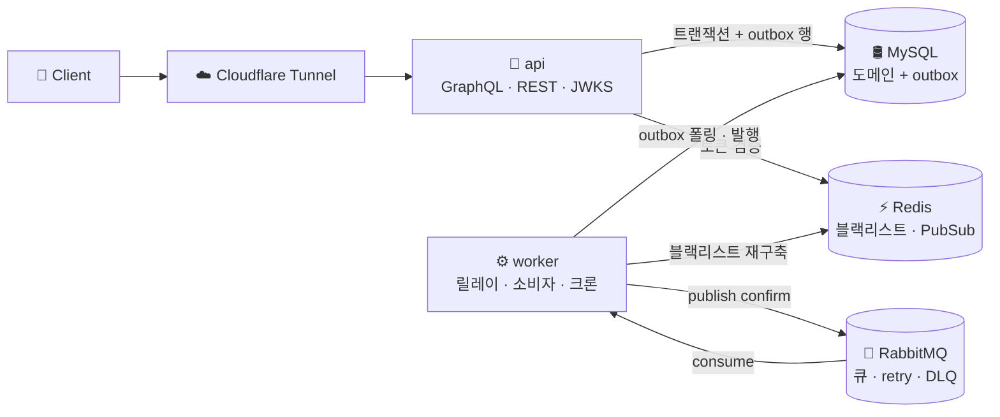
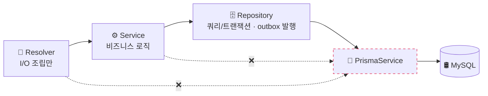
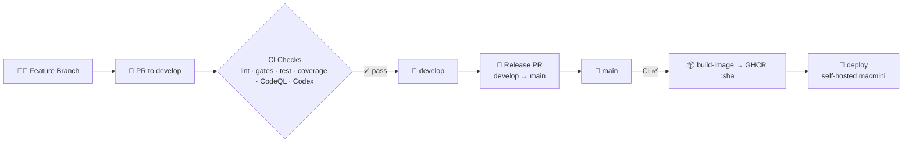

<div align="center">


# 케이퀵 - CaQuick Backend

**시각 기반 올인원 맞춤 케이크 주문 플랫폼**

케이크 디자인 탐색 → 디자인 수정 → 가게 매칭 → 주문·결제·픽업까지<br/>
단절된 모든 과정을 하나의 시각 기반 흐름으로 통합합니다.

<br/>

[](./LICENSE)
[](https://nodejs.org/)
[](https://nestjs.com/)
[](https://www.typescriptlang.org/)

[](https://github.com/CaQuick/caquick-be/actions/workflows/pr-check.yml)
[](https://github.com/CaQuick/caquick-be/actions/workflows/codeql.yml)
[](https://app.codecov.io/gh/CaQuick/caquick-be)
[](https://github.com/CaQuick/caquick-be/commits/develop)

**한국어** | [English](./README.en.md)

</div>

## 📑 목차

- [기획 배경](#-기획-배경)
- [기술 스택](#-기술-스택)
- [아키텍처](#%EF%B8%8F-아키텍처)
- [디렉터리 구조](#-디렉터리-구조)
- [시작하기](#-시작하기)
- [GraphQL](#-graphql)
- [테스트](#-테스트)
- [운영 (홈서버)](#-운영-홈서버)
- [CI / CD](#%EF%B8%8F-ci--cd)
- [팀](#-팀)
- [라이선스](#-라이선스)

## 🎯 기획 배경

케이크 디자인 주문은 본질적으로 **맞춤형 상품**이지만, 기존 플랫폼들은 이에 최적화되어 있지 않습니다.

| 채널           | 한계                                                                                                 |
| -------------- | ---------------------------------------------------------------------------------------------------- |
| **인스타그램** | 디자인 영감은 풍부하지만 통합된 예약·주문·결제 흐름이 없음                                           |
| **네이버**     | 가게 검색·예약 기능은 있지만 디자인 카탈로그·탐색 UX가 약함                                          |
| **카톡·DM**    | 이미지 첨부는 가능하지만 정형 디자인 명세 양식이 없어 매번 캡처·설명·확인을 비정형으로 주고받아야 함 |

사용자는 결국 **여러 플랫폼을 옮겨 다니며 캡처 + 편집 + 설명을 조합**하는 비효율을 감내해야 합니다.

**케이퀵**은 이 단절된 과정을 시각 기반 단일 흐름으로 통합하는 서비스입니다.

## 🧱 기술 스택

### Language & Runtime


- **TypeScript**(strict 모드)와 **Node.js 24.x**를 사용하며, 패키지 관리는 Corepack이 제공하는 **Yarn 4**로 합니다.

### Framework & API


- **NestJS 11** 앱 하나를 역할(`APP_ROLE=api|ws|worker`)만 달리해 여러 프로세스로 띄우는 모듈러 모놀리스입니다.
- **GraphQL**(schema-first SDL) + **Apollo Server 5** + `@nestjs/graphql`
  - 모든 필드에 description을 작성해 커버리지 100%를 유지합니다.
  - 실시간 알림은 Redis PubSub 기반 Subscription으로 전달합니다.
- 문서와 타입 자동 생성
  - **GraphQL Code Generator**: SDL → TypeScript 타입
  - **SpectaQL**: GraphQL HTML 문서(`/gql-docs`)
  - **Swagger**: REST 문서(`/rest-docs`)

### Data & Messaging


- **MySQL 8** + **Prisma 7**: 마이그레이션도 Prisma가 관리하고, soft-delete는 Prisma extension이 조회 조건을 자동으로 붙입니다.
- **Redis 7**은 두 가지 용도로 씁니다.
  - 인증 블랙리스트: 정지·탈퇴·비밀번호 변경이 일어난 계정의 토큰을 즉시 차단합니다.
  - PubSub: GraphQL Subscription을 전달합니다.
- **RabbitMQ 4**는 이벤트 백본입니다.
  - 도메인 트랜잭션에 함께 기록된 outbox 행을 릴레이가 브로커로 보냅니다.
  - 소비자는 재시도 큐와 DLQ(dead letter queue)를 거쳐 처리합니다.

### Auth & Validation


- 로그인 방식
  - 구매자: **OIDC**(Google·Kakao, `openid-client`)
  - 판매자·관리자: **Argon2**로 해시한 자격증명
- 토큰
  - 액세스 토큰은 **RS256으로 서명한 JWT**이며, 공개키는 `/.well-known/jwks.json`으로 공개합니다.
  - refresh 토큰은 쿠키로 전달하고 사용할 때마다 회전합니다.
- 입력 검증은 `class-validator`·`class-transformer`를 적용한 DTO 클래스가 담당합니다.

### Testing


- **Jest** + **Testcontainers** + **Supertest**
  - Testcontainers가 실제 MySQL·Redis 컨테이너를 자동으로 띄우고, RabbitMQ 소비자 테스트는 실제 브로커 컨테이너를 따로 띄웁니다.
  - HTTP 경로는 Supertest로 검증합니다.
- DB와 Redis를 mock하지 않고 325개 suite, 3,000개가 넘는 케이스를 실제 저장소에 대해 통합 테스트합니다. 자세한 구성은 [테스트](#-테스트) 절에 있습니다.

### Code Quality & Security


- 정적 검사: **ESLint**(strict 규칙 + `boundaries` 플러그인으로 feature 경계 강제) · **Prettier**. **Husky**와 **lint-staged**가 커밋·push 전에 실행합니다.
- 구조 검사: **dependency-cruiser**(레이어 방향·순환 의존 금지)가 게이트로 막고, **knip**은 사용하지 않는 코드를 리포트합니다.
- 커밋 메시지: **commitlint**가 Conventional Commits 형식을 검사합니다.
- 커버리지·보안·의존성: **Codecov**(patch 80%, 전역 statements 96% · branches 86%) · **CodeQL** · **Dependabot**
- 이 레포만의 게이트
  - `dto:check`: SDL input ↔ DTO class 동기화
  - `docs:check`: SDL description 커버리지
  - 모델 소유권·경계 read spec

### DevOps & Infrastructure

![AWS S3][aws-s3]


- **홈서버(맥미니, OrbStack)** 가 운영 환경입니다.
  - [`infra/`](./infra/)의 compose 파일이 api·worker·MySQL·Redis·RabbitMQ·백업 컨테이너와 관측 스택을 함께 띄웁니다.
  - 인바운드 포트는 열지 않으며, 외부 요청은 **Cloudflare Tunnel**(`api.caquick.site`)로만 들어옵니다.
- **AWS S3**: 미디어 저장(Presigned URL 업로드)과 일일 DB 백업(14일 보존)
- **Terraform**: S3 버킷, 최소 권한 IAM 사용자 2개, GitHub 레포·브랜치 보호 설정
- 관측 스택
  - **Prometheus**: 앱 `/metrics`, RabbitMQ, mysqld·redis exporter, cAdvisor를 수집합니다.
  - **Loki**: docker 로그를 모읍니다. `requestId`·`eventId`로 api와 worker의 로그를 이어 볼 수 있습니다.
  - **Grafana**: 대시보드 2개와 통합 경보를 제공하며, 경보는 Discord로 전달됩니다.
- **GitHub Actions**: PR 검증 → main 머지 시 arm64 이미지 빌드(GHCR) → 셀프호스트 러너 자동 배포. CodeQL, Dependabot, Discord 알림도 Actions로 동작합니다.
- **Winston**: `role`·`requestId`·`eventId` 필드를 포함한 구조화 JSON 로그

## 🏗️ 아키텍처

### 모듈러 모놀리스 + 이벤트 백본

이미지 하나를 역할만 달리해 두 개의 프로세스로 띄웁니다.

- **api**: GraphQL, REST, 문서, JWKS를 제공합니다.
- **worker**: outbox 릴레이, 이벤트 소비, 크론 작업, 블랙리스트 재구축을 담당합니다.
- 도메인을 넘나드는 부수효과(알림 생성, 일일 주문 한도 갱신 등)의 전달 경로
  1. 도메인 write와 같은 트랜잭션에 outbox 행을 기록합니다.
  2. worker의 릴레이가 outbox 행을 RabbitMQ로 발행합니다(publisher confirm).
  3. worker의 소비자가 큐에서 받아 처리합니다. 실패하면 재시도 큐를 거치고, 상한을 넘기면 DLQ로 보내고 경보합니다.
- 전달은 at-least-once이므로 소비자는 멱등하게 구현합니다.


```mermaid
flowchart LR
    Client[📱 Client]
    Tunnel[☁️ Cloudflare Tunnel]
    API[🧩 api<br/>GraphQL · REST · JWKS]
    Worker[⚙️ worker<br/>릴레이 · 소비자 · 크론]
    MySQL[(🛢️ MySQL<br/>도메인 + outbox)]
    Redis[(⚡ Redis<br/>블랙리스트 · PubSub)]
    MQ[(📨 RabbitMQ<br/>큐 · retry · DLQ)]

    Client --> Tunnel --> API
    API -->|트랜잭션 + outbox 행| MySQL
    API -->|토큰 검증| Redis
    Worker -->|outbox 폴링 · 발행| MySQL
    Worker -->|publish confirm| MQ
    MQ -->|consume| Worker
    Worker -->|블랙리스트 재구축| Redis
```

### 레이어 의존성

요청은 항상 한 방향으로만 흐릅니다.

- Resolver나 Service가 Prisma에 직접 접근하는 것은 `dependency-cruiser`가 차단합니다.
- feature 사이의 import는 각 feature의 `index.ts`(공개 API)를 통해서만 허용합니다(ESLint `boundaries` 규칙).


```mermaid
flowchart LR
    Resolver[🧩 Resolver<br/>I/O 조립만]
    Service[⚙️ Service<br/>비즈니스 로직]
    Repo[🗄️ Repository<br/>쿼리/트랜잭션 · outbox 발행]
    Prisma[🔷 PrismaService]
    DB[(🛢️ MySQL)]

    Resolver --> Service --> Repo --> Prisma --> DB
    classDef forbidden stroke:#E0234E,stroke-dasharray:5 5
    Resolver -. "❌" .-> Prisma:::forbidden
    Service -. "❌" .-> Prisma:::forbidden
```

### 핵심 설계 원칙

- **모델 소유권**: 모든 모델에는 소유 feature가 하나씩 있습니다.
  - write는 소유 feature에서만 허용합니다(`model-ownership.spec`이 검사).
  - 다른 feature의 데이터를 읽어야 하는 경우는 허용 목록으로 관리합니다.
  - 매장명이나 상품 썸네일처럼 다른 도메인의 표시값은 조인하지 않고 **생성 시점에 스냅샷 컬럼으로 복사**해 둡니다.
- **Schema-First GraphQL**: SDL 파일이 단일 소스이며 `yarn graphql:codegen`으로 타입을 동기화합니다. 모든 `input`에는 DTO 클래스가 있어야 하고 모든 필드에는 description이 있어야 하며, 둘 다 게이트가 검사합니다.
- **에러 카탈로그**: 도메인 오류는 `DomainException('CODE')` 하나로 던지고, 코드와 HTTP status와 메시지는 카탈로그가 정본으로 관리합니다. 클라이언트는 응답의 `extensions.code`로 분기합니다.
- **인증 경로에서 DB 조회 0회**: 서명이 유효한 토큰의 클레임을 신뢰합니다.
  - 정지·탈퇴·비밀번호 변경은 Redis 블랙리스트가 즉시 차단합니다.
  - Redis에 장애가 나면 DB 조회로 폴백하고 경보를 보냅니다.
- **Fail-fast**: production에서 JWT 키, S3 버킷, 문서 토큰, 메트릭 토큰이 없으면 부팅을 차단합니다. `REDIS_URL`과 `RABBITMQ_URL`은 모든 환경에서 필수입니다.
- **운영 경보의 단일 출구**: 사람이 개입해야 하는 상태(outbox FAILED, DLQ 적재, 블랙리스트 폴백, 부팅 실패, 백업 실패, Grafana 규칙)만 Discord로 보냅니다.

각 규칙의 근거와 예외는 [docs/guide/architecture-conventions.md](./docs/guide/architecture-conventions.md)에 정리되어 있습니다.

## 📁 디렉터리 구조

```text
caquick-be/
├── src/
│   ├── main.ts                  # 부트스트랩 (역할별 배선, 부팅 실패 경보)
│   ├── app.module.ts            # AppModule.forRole(api|ws|worker)
│   ├── features/                # 도메인 모듈 (1 폴더 = 1 도메인, SDL·Resolver·Service·Repository colocate)
│   │   ├── auth/                #   OIDC · 자격증명 · 계정 · 프로필 · JWKS
│   │   ├── store/               #   매장 · 픽업 일정 · 판매자/관리자 매장 관리
│   │   ├── product/             #   상품 · 카테고리 · 판매자/관리자 상품 관리
│   │   ├── order/               #   주문 · 결제 · 일일 한도
│   │   ├── review/              #   리뷰 · 좋아요 · 신고 · 모더레이션
│   │   ├── conversation/        #   구매자 ↔ 판매자 채팅
│   │   ├── notification/        #   알림센터 · outbox 소비자 · 관리자 발송
│   │   ├── search/              #   검색 · 인기 검색어
│   │   ├── region/              #   지역
│   │   ├── mypage/              #   구매자 마이페이지 조립
│   │   ├── dashboard/           #   관리자 대시보드
│   │   ├── audit-log/           #   감사 기록 포트
│   │   ├── outbox/              #   outbox 발행 · 릴레이 · RabbitMQ 소비자 호스트 · requeue
│   │   ├── system/              #   /health/live · /health/ready
│   │   └── core/                #   GraphQL 루트 · 공용 스칼라
│   ├── common/                  # 무의존 공용 (에러 카탈로그 · 커서 · 유틸)
│   ├── global/                  # 횡단 (auth 가드/블랙리스트 · alerting · metrics · logger · redis · pubsub · storage)
│   ├── config/                  # env 파싱 · 검증 (production 필수 키 fail-fast)
│   ├── prisma/                  # PrismaService · soft-delete extension · activeWhere
│   ├── graphql/                 # codegen 출력 (수정 금지)
│   └── test/                    # 팩토리 · real-DB 모듈 빌더 · 소유권/경계 게이트 spec
├── prisma/                      # schema.prisma · migrations · seed
├── infra/                       # 홈서버 운영 compose · 배포 스크립트 · 관측 설정 · runbook
├── terraform/                   # GitHub 레포/브랜치 보호 + AWS(S3 · IAM) IaC
├── scripts/                     # 게이트·운영 스크립트(dto:check · docs:check · outbox:requeue) + 인프라 spec
├── docs/guide/                  # 아키텍처 컨벤션(정본)
└── .github/workflows/           # pr-check · build-image · deploy · codeql · knip · nestjs-doctor · discord-notify
```

## 🚀 시작하기

### Prerequisites

| 항목    | 버전               | 비고                                                                          |
| ------- | ------------------ | ----------------------------------------------------------------------------- |
| Node.js | **24.x**           | `nvm install 24`를 권장합니다                                                 |
| Yarn    | **4.x** (Corepack) | `corepack enable`을 한 번 실행합니다                                          |
| Docker  | latest             | 로컬 MySQL·Redis·RabbitMQ(`docker-compose.yml`)와 testcontainers에 필요합니다 |

### 설치 & 실행

```bash
corepack enable && yarn install          # postinstall이 Prisma 클라이언트를 src/generated/에 생성한다
docker compose up -d                     # MySQL 3306 · Redis 6379 · RabbitMQ 5672
touch .env                               # 아래 "필요 환경 변수" 표를 참고해 채운다
yarn prisma:migrate:dev                  # 마이그레이션 적용
yarn prisma:seed                         # (선택) 시드 데이터
yarn start:dev                           # api 역할, http://localhost:4000/graphql
APP_ROLE=worker PORT=4001 yarn start:dev # (선택) 이벤트 소비까지 보려면 worker를 함께 띄운다
```

운영 엔드포인트

- `GET /health/live`: 프로세스 생존만 확인합니다.
- `GET /health/ready`: MySQL과 Redis(worker는 RabbitMQ까지)의 연결을 확인하고, 하나라도 끊겨 있으면 503을 반환합니다.
- `GET /metrics`: Prometheus 메트릭. Bearer 토큰(`METRICS_ACCESS_TOKEN`)이 필요합니다.

### 필요 환경 변수

> `.env.example`은 레포에 두지 않습니다. 검증 스키마는 [`src/config/`](./src/config/)에, 운영 키 목록은 [`infra/app.env.example`](./infra/app.env.example)에 있습니다.

| 카테고리            | 키                                                                                                                                                                                                                                                                         |
| ------------------- | -------------------------------------------------------------------------------------------------------------------------------------------------------------------------------------------------------------------------------------------------------------------------- |
| **서버**            | `NODE_ENV`, `PORT`, `BACKEND_BASE_URL`, `FRONTEND_BASE_URL`(쉼표로 여러 개를 적을 수 있으며 CORS와 returnTo 검사에 사용), `APP_ROLE`(`api`·`ws`·`worker`, 기본 `api`), `TRUST_PROXY_HOPS`                                                                                  |
| **DB**              | `DATABASE_URL`                                                                                                                                                                                                                                                             |
| **Redis (필수)**    | `REDIS_URL`. 인증 블랙리스트와 Subscription PubSub에 사용합니다. `maxmemory`를 설정했다면 정책이 `noeviction`이어야 하며, 아니면 worker가 점검해 경보를 보내고 인증은 DB 폴백으로 동작합니다                                                                               |
| **RabbitMQ (필수)** | `RABBITMQ_URL`. outbox 릴레이에서 소비자로 이어지는 이벤트 백본에 사용합니다                                                                                                                                                                                               |
| **JWT / Auth**      | `JWT_PRIVATE_KEY_PEM_B64`(또는 `JWT_PRIVATE_KEY_PATH`)는 RS256 서명키이며 운영에서 필수입니다. `JWT_PUBLIC_KEY_PEM_B64`는 생략하면 개인키에서 유도합니다. 그 밖에 `JWT_ISSUER`, `JWT_AUDIENCE`, `JWT_ACCESS_EXPIRES_SECONDS`, `AUTH_REFRESH_EXPIRES_DAYS`, `AUTH_COOKIE_*` |
| **OIDC**            | `OIDC_GOOGLE_CLIENT_ID/SECRET/ISSUER_URL`, `OIDC_KAKAO_CLIENT_ID/SECRET/ISSUER_URL`, `OIDC_TEMP_COOKIE_MAX_AGE_MS`                                                                                                                                                         |
| **AWS S3**          | `AWS_ACCESS_KEY_ID`, `AWS_SECRET_ACCESS_KEY`(IAM 사용자 `caquick-app`, 미디어 put/get 권한만), `AWS_REGION`, `AWS_S3_BUCKET`(운영 필수), `S3_PRESIGN_EXPIRES_SECONDS`                                                                                                      |
| **문서 · 메트릭**   | `DOCS_ACCESS_TOKEN`(`/gql-docs`와 `/rest-docs` 접근 토큰, 운영 필수), `METRICS_ACCESS_TOKEN`(`/metrics` Bearer 토큰, 운영 필수)                                                                                                                                            |
| **경보 (선택)**     | `DISCORD_ALERT_WEBHOOK_URL`(없으면 로그로만 남깁니다), `ALERT_DEDUPE_WINDOW_MS`(기본 5분), `BOOT_ALERT_STATE_DIR`(부팅 실패 경보의 억제 파일 위치, 기본 `~/.caquick/boot-alert`)                                                                                           |
| **Outbox (선택)**   | `OUTBOX_DISPATCH_ENABLED`(`false`로 끄는 용도만 있으며 켜는 것은 worker 역할이 결정), `OUTBOX_POLL_INTERVAL_MS`, `OUTBOX_BATCH_SIZE`, `OUTBOX_MAX_ATTEMPTS`, `OUTBOX_PARTITION_CONCURRENCY`                                                                                |
| **시드 (선택)**     | `ADMIN_SEED_USERNAME`, `ADMIN_SEED_PASSWORD`, `SELLER_SEED_PASSWORD`                                                                                                                                                                                                       |

### 자주 쓰는 스크립트

| 명령                      | 용도                                                                                                      |
| ------------------------- | --------------------------------------------------------------------------------------------------------- |
| `yarn validate`           | lint, tsc, dto:check, docs:check, arch:check, test:scripts, test:cov를 차례로 실행합니다(pre-push와 동일) |
| `yarn test [경로]`        | Jest 실 DB 통합 테스트를 실행합니다(Docker 필요)                                                          |
| `yarn test:scripts`       | 인프라와 워크플로 spec(`scripts/*.spec.ts`)을 실행합니다                                                  |
| `yarn graphql:codegen`    | SDL에서 TypeScript 타입을 생성합니다                                                                      |
| `yarn dto:check`          | SDL input과 DTO class의 동기화를 검사합니다                                                               |
| `yarn docs:check`         | SDL description 커버리지를 검사합니다                                                                     |
| `yarn arch:check`         | dependency-cruiser로 레이어 방향과 순환 의존을 검사합니다                                                 |
| `yarn prisma:migrate:dev` | 마이그레이션을 생성·적용하고 클라이언트를 다시 생성합니다                                                 |
| `yarn graphql:docs`       | SpectaQL HTML 문서를 `public/`에 빌드합니다                                                               |
| `yarn outbox:requeue`     | 운영에서 FAILED 상태의 outbox 이벤트를 재처리합니다(`--id`, `--event-type`, `--all`, `--republish`)       |

## 🧬 GraphQL

**Schema-First** 방식을 씁니다. `.graphql` SDL 파일이 단일 소스이며, 변경할 때마다 `yarn graphql:codegen`으로 TypeScript 타입을 동기화합니다.

```graphql
# src/features/auth/auth-user-profile.graphql
extend type Query {
  """
  현재 로그인한 유저 정보 조회
  """
  me: MePayload!
}
```

- 도메인마다 `extend type Query`와 `extend type Mutation`으로 스키마를 확장하며, 루트 정의는 `src/features/core/root.graphql`에 있습니다.
- 모든 `input`에는 대응하는 DTO 클래스가 있어야 하고(`dto:check`가 검사), 모든 필드에는 description이 있어야 합니다(`docs:check`가 검사, 현재 커버리지 100%).
- 목록 조회는 키셋 커서 방식으로 `{ items, totalCount, hasMore, nextCursor }` 형태를 반환하고, 에러는 `extensions.code`(카탈로그 코드)와 `extensions.classification`(HTTP 분류)으로 전달합니다.
- 생성된 타입 파일(`src/graphql/graphql.types.ts`)은 자동 생성물이므로 직접 수정하지 않습니다. 운영 환경에서는 Playground와 introspection을 끕니다.

## 🧪 테스트

> **DB와 Redis를 mock하지 않습니다.** [Testcontainers](https://node.testcontainers.org/)가 실제 MySQL 8과 Redis 7 컨테이너를 띄우고 Prisma 마이그레이션까지 적용한 뒤에 검증합니다. RabbitMQ 소비자 호스트는 실제 브로커 컨테이너로 검증합니다.

| 레이어                                 | 목적                                                                                                      |
| -------------------------------------- | --------------------------------------------------------------------------------------------------------- |
| `*.service.spec.ts`                    | 분기, 예외, 도메인 로직을 실제 DB로 검증합니다(주력)                                                      |
| `*.resolver.spec.ts`                   | Resolver부터 DB까지의 전체 경로를 1~2개 케이스로 검증합니다                                               |
| `*.repository.spec.ts`                 | Repository에서만 도달할 수 있는 계약을 검증합니다                                                         |
| `*.input.spec.ts` · `*.helper.spec.ts` | DB가 필요 없는 순수 단위 테스트입니다                                                                     |
| `src/test/*.spec.ts`                   | 모델 소유권, 경계 read, 감사 기록 경로, 역할별 인가 커버리지, 모듈 배선을 검사하는 게이트입니다           |
| `scripts/*.spec.ts`                    | compose 렌더링, 백업과 복구(실제 mysql), 배포 워크플로, 관측 설정, 빌드 설정을 검사하는 인프라 spec입니다 |

```bash
yarn test                     # 전체 실행 (Docker 필요)
yarn test src/features/order  # 특정 도메인만 실행
yarn test:cov                 # 커버리지 측정 (임계값: statements 96 / branches 86 / functions 92 / lines 96)
yarn test:scripts             # 인프라 spec 실행
```

검사기와 게이트를 만들 때는 "막아야 할 것을 실제로 막는지"를 확인하는 **반증 케이스**를 테스트의 본체로 둡니다. CI도 같은 testcontainers 구성으로 실행하므로 로컬과 환경 차이가 거의 없습니다.

## 🖥️ 운영 (홈서버)

맥미니 한 대(OrbStack)에서 운영 compose가 13개 컨테이너를 실행합니다. 파일과 절차는 [`infra/`](./infra/)에 있고, 백업과 복구, 롤백, outbox 재처리 방법은 [`infra/runbook.md`](./infra/runbook.md)에 정리되어 있습니다.

```bash
docker build -t caquick-be:local .                        # 멀티스테이지 빌드(deps → build → runtime, non-root)
cd infra && cp .env.example .env && cp app.env.example app.env   # 값을 채운다 (운영에서는 배포 잡이 secrets로 생성한다)
docker compose --profile migrate run --rm migrate         # prisma migrate deploy
docker compose up -d                                      # api · worker · mysql · redis · rabbitmq · backup
docker compose --profile observability up -d              # alloy · loki · prometheus · grafana · exporter
docker compose --profile edge up -d                       # cloudflared (TUNNEL_TOKEN 필요)
```

- 설정 파일은 둘로 나뉩니다. 공개 인터페이스를 가진 api 컨테이너가 root 비밀번호나 터널 토큰을 갖지 않게 하기 위해서입니다.
  - `.env`: compose 보간 값과 저장소·터널 비밀
  - `app.env`: 앱(api·worker·migrate)이 읽는 값만
- 인바운드 포트는 열지 않습니다. 진단용 포트(Grafana 3001, Prometheus 9090, RabbitMQ 관리 15672)는 모두 `127.0.0.1`에만 바인딩합니다.
- 백업과 경보
  - 매일 mysqldump를 S3에 올립니다(14일 보존).
  - Grafana 경보 8종과 앱 경보를 Discord로 보냅니다.
- 컨테이너 메모리 상한의 합계는 6 GB 이하이며, 실측 표는 runbook에 있습니다.
- 포트 미노출, Redis `noeviction`, 헬스체크, 메모리 상한 합계, 비밀 분리 같은 운영 형태는 `scripts/compose-config.spec.ts`가 검사해 회귀를 막습니다.

## ⚙️ CI / CD

### 워크플로우

| Workflow                         | Trigger                                     | 역할                                                                                                                                                     |
| -------------------------------- | ------------------------------------------- | -------------------------------------------------------------------------------------------------------------------------------------------------------- |
| `pr-check.yml`                   | PR · push (main/develop)                    | codegen, tsc, lint, dto/docs/arch 게이트, 인프라 spec, 통합 테스트, 커버리지, 빌드 2회(캐시 회귀 검출)를 실행합니다                                      |
| `codeql.yml`                     | PR · push · 주간                            | CodeQL 정적 보안 분석을 실행합니다                                                                                                                       |
| `knip.yml` · `nestjs-doctor.yml` | PR                                          | 사용하지 않는 코드와 NestJS 점검 결과를 코멘트로 남깁니다(advisory)                                                                                      |
| `build-image.yml`                | PR(빌드만) · main **CI 성공 뒤**(GHCR 푸시) | arm64 이미지를 빌드해 `ghcr.io/caquick/caquick-be:<sha>`로 푸시합니다(가변 태그는 두지 않습니다)                                                         |
| `deploy.yml`                     | `build-image` 성공(main) · 수동(롤백 sha)   | 셀프호스트 러너(맥미니)가 secrets로 `.env`·`app.env`(600)를 만들고 pull → migrate → worker → api → ready 대기 → 관측 순서로 배포한 뒤 Discord에 알립니다 |
| `discord-notify.yml`             | PR · push · issue                           | Discord에 알림을 보냅니다                                                                                                                                |

### 흐름


```mermaid
flowchart LR
    Dev[👨‍💻 Feature Branch]
    PR[🔀 PR to develop]
    Checks{CI Checks<br/>lint · gates · test · coverage · CodeQL · Codex}
    Develop[🌿 develop]
    Release[🔀 Release PR<br/>develop → main]
    Main[🌲 main]
    Image[📦 build-image → GHCR :sha]
    Deploy[🚀 deploy<br/>self-hosted macmini]

    Dev --> PR --> Checks
    Checks -->|✅ pass| Develop
    Develop --> Release --> Main
    Main -->|CI ✅| Image --> Deploy
```

### 브랜치 보호

- **main**: PR과 CI 통과가 필수이며 직접 push는 금지합니다.
- **develop**: PR과 CI 통과를 권장합니다. Admin의 직접 push는 릴리즈 뒤 fast-forward 동기화 용도로만 허용합니다.
- 필수 status check: `check`, `pr-title`, `coverage-report`, `Analyze (javascript-typescript)`
- 사람의 승인 대신 봇 리뷰가 실질적인 게이트 역할을 합니다.
  - Codex: 모든 PR
  - CodeRabbit: main 대상 PR
- **production Environment**는 `main` 브랜치에서만 사용할 수 있고, 셀프호스트 러너 라벨(`macmini`)은 `deploy.yml`만 씁니다. 공개 레포의 PR 코드가 홈서버에서 실행되지 않게 하기 위해서입니다.
- 브랜치 보호, 레포 설정, AWS 자원은 [`terraform/`](./terraform/)에서 코드로 관리합니다.

## 👤 팀

<table>
  <tr>
    <td align="center">
      <a href="https://github.com/chanwoo7">
        <br/>
        <sub><b>chanwoo7</b></sub>
      </a>
      <br/>
      <sub>Backend Developer</sub>
    </td>
  </tr>
</table>

## 📜 라이선스

이 프로젝트는 **Apache License 2.0**으로 배포됩니다.

- 상업적 이용, 수정, 재배포를 자유롭게 허용합니다.
- 재배포 시 저작권 고지와 라이선스 사본을 유지하고, 수정한 파일에는 변경 사실을 표시해야 합니다.
- 기여자의 특허 라이선스가 함께 부여됩니다.

전체 조항은 [LICENSE](./LICENSE) 파일을 참고하세요.

Copyright © 2026 CaQuick. All rights reserved.

<!-- ─────────────────────────────────────────────────────────
     AWS service badge 정의 (base64-embedded SVG icons, SVGO 최적화 적용)
     SVG 출처: gilbarbara/logos (MIT) — .github/assets/aws/
     GitHub camo proxy URL 길이 ~4KB 한도 준수를 위해 SVGO multipass 처리
     ───────────────────────────────────────────────────────── -->

[aws-s3]: https://img.shields.io/badge/AWS%20S3-569A31?style=flat&logo=
